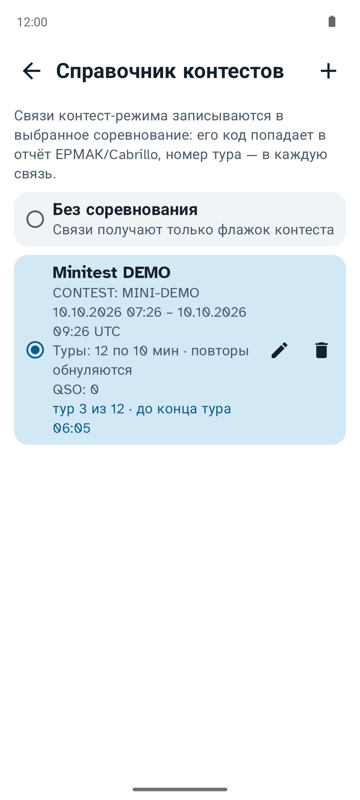
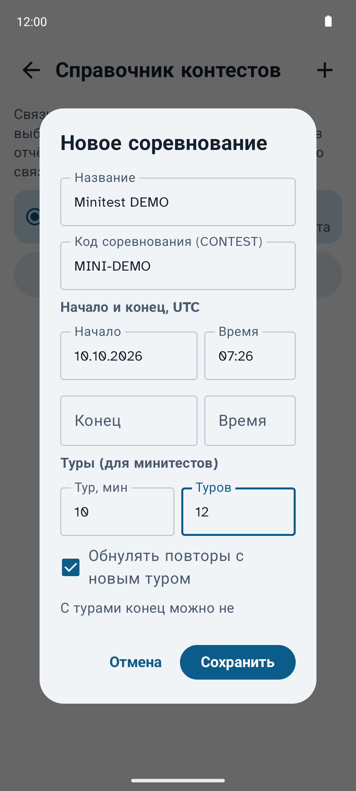
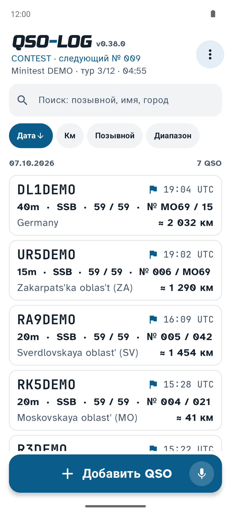
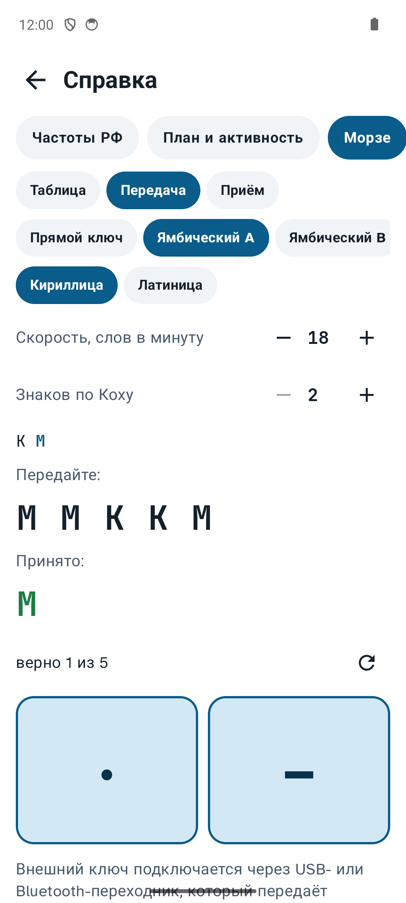
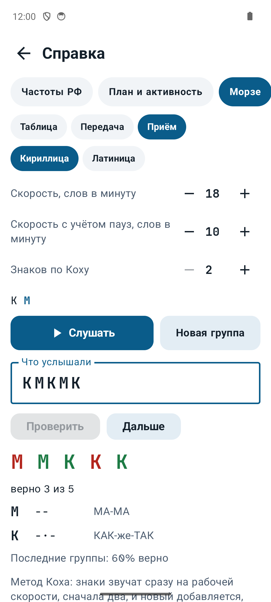
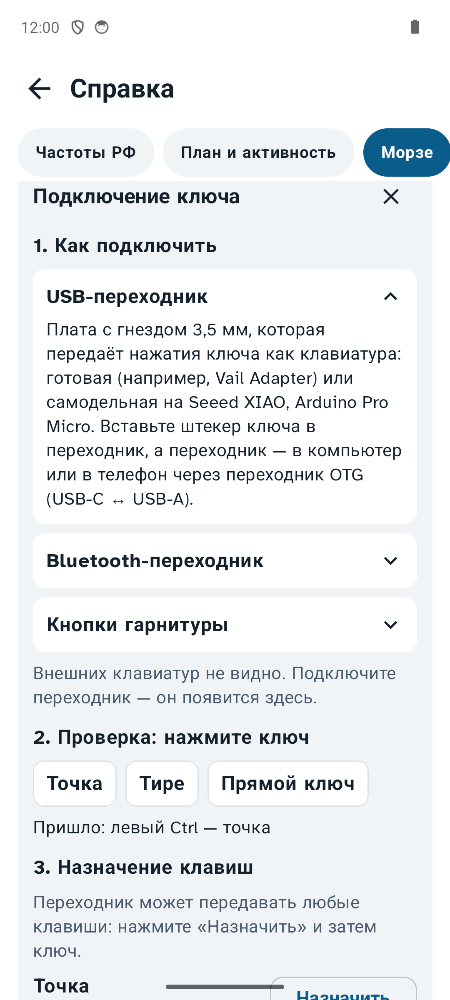
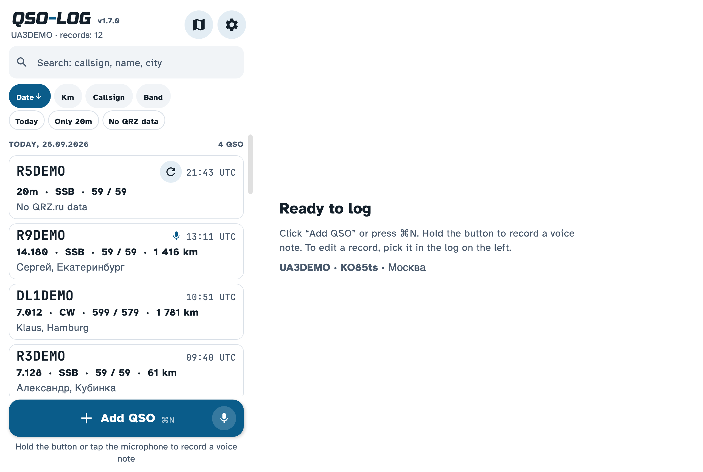

<h1>
<picture>
<source media="(prefers-color-scheme: dark)" srcset="docs/logo-dark.png">

</picture>
</h1>

[Русский](README.md) · **English**

QSO-LOG is a logbook for radio amateurs. It runs on Android, macOS, Windows and Linux, and does the same things
on the phone and on the computer.

A QSO takes a few taps: callsign, frequency, RST. The app looks up the other station's name and city on QRZ.ru
or QRZ.com, works out the distance and draws the path on a map. You can attach a voice note to a QSO. Contest mode
gives fast entry with exchange numbers, and the log exports to Cabrillo and to ЕРМАК, the Russian contest format.
A dashboard shows the log in charts. The log exports to ADIF and CSV, and several devices can keep one log through
your own Google Sheet. Buttons and text are large, so you can log on the air; with an external keyboard you can log
without touching the screen at all.

The app is free and open source. The interface is in Russian and English.

<p align="center">

</p>

## Download

| System | Version | File |
|---|---|---|
| Android 8.0 or newer | 0.39.1 | [QSO-LOG-0.39.1.apk](../../releases/tag/v0.39.1) |
| macOS 11 or newer, Apple silicon (M1 and newer) | 1.18.0 | [QSO-LOG-1.18.0-macos-arm64.dmg](../../releases/tag/desktop-v1.18.0) |
| macOS 11 or newer, Intel | 1.18.0 | [QSO-LOG-1.18.0-macos-x64.dmg](../../releases/tag/desktop-v1.18.0) |
| Windows 10 and 11, 64-bit | 1.18.0 | [QSO-LOG-1.18.0-windows-x64.zip](../../releases/tag/desktop-v1.18.0) |
| Linux: Ubuntu 22.04+, Debian 12, Mint | 1.18.0 | [QSO-LOG-1.18.0-linux-amd64.deb](../../releases/tag/desktop-v1.18.0) |

How to install: [Android](#android) · [macOS](#macos) · [Windows](#windows) · [Linux](#linux).
The [project page](https://vladkondratyev.github.io/qso-log/?lang=en) offers the right file for your system.

Release notes on GitHub are written in Russian. Most screenshots below show the Russian interface; the language
is switched in Settings and changes at once.

## Contents

- [First start](#first-start)
- [New QSO](#new-qso)
- [Contest mode](#contest-mode)
- [Keyboard only](#keyboard-only)
- [Log](#log)
- [Dashboard](#dashboard)
- [Search history](#search-history)
- [Station data](#station-data)
- [Voice notes](#voice-notes)
- [Distance and maps](#distance-and-maps)
- [Export and import](#export-and-import)
- [Sync through a Google Sheet](#sync-through-a-google-sheet)
- [Reference and calculators](#reference-and-calculators)
- [Settings](#settings)
- [On the computer](#on-the-computer)
- [Installation](#installation)
- [Where the data is kept](#where-the-data-is-kept)
- [Known issues](#known-issues)
- [For developers](#for-developers)

## First start

The app asks two things: your callsign and where you are. Instead of a QTH locator you can type
a city, and the locator is found for you. Every step can be skipped and filled in later in Settings. QRZ.ru and QRZ.com
accounts (for the other station's name and town) are added later in Settings — the QSO card reminds you.

After an update the app shows once what is new in that version.

After that the "Add QSO" button appears at the bottom of the screen. Every QSO starts there.

<p>


</p>

## New QSO

The card opens with the cursor in the callsign field. The UTC date and time are set for you. Mode, band and frequency
come from the previous QSO, so usually only the callsign and RST are left.

What helps while typing:

- From the second letter, callsigns from your log appear under the field. Pick one instead of typing it all.
- From the fourth letter, the app looks the station up on QRZ.ru (and QRZ.com) and fills in name, city and locator.
- A yellow box shows how many times you have worked this callsign and when last. If you worked it on several bands,
  small marks like "40m 25.09.26 · 20m 07.10.26" show the last QSO on each band.
- A red "Dupe" box appears if you already worked the station today on the same band and mode. Handy in contests.
- Frequency can be typed in kHz: 14195 becomes 14.195 MHz, and the band is picked from it.
- For RST the digit keyboard opens, with buttons for common reports under the field: 59, 57, 599, −10 and so on.
- "+ Next" saves the QSO and opens a new card on the same frequency. Useful in a pile-up.

The other ADIF fields are in collapsible groups: station worked, QSO, my station, propagation. The QSO time can be
taken when the card opens or when it is saved; this is a setting.

A saved QSO has three buttons at the bottom: delete, share (as text, with the voice note, to a messenger or e-mail)
and save.

<p>


</p>

### Built-in keyboard

Instead of the system keyboard you can use the app's own, as in contest loggers: big keys with digits and Latin
letters, "/", "-", "." for the frequency, and ⌫. It types the callsign, frequency and RST, and the button under the
keys moves to the next field: callsign → frequency → RST sent → RST received. Name, city and comment still use the
system keyboard; the built-in one hides meanwhile.

There is a normal and a compact version; the compact one is a third lower and leaves more room for the card.
Choose in Settings → "QSO entry": System, Built-in, Built-in, compact. The choice is remembered and applies to the
normal card and to contest mode.

## Contest mode

Contests need speed, so there is a separate mode. Switch it on in the ⋮ menu (below "Reference and calculators") — **CONTEST MODE**
(also in Settings → "QSO entry", or Ctrl+K on a keyboard).
It turns off every time the app starts, so you don't keep your everyday log in it by accident.

Under the switch you choose what to send:

- **Serial number**: sent as 001, 002… and incremented after every logged QSO.
- **Fixed code**: the same every time: district, region, zone (MO69, EU, 16).

In this mode "Add QSO" opens a simplified card: callsign, exchange sent and received, RST. The received exchange can
be anything: 015, MO69, EU, ABCD, 20. RST is filled in (59 or 599) and can be folded into one line. Band and mode are
in the header and change with a tap.

At the bottom is the built-in keyboard. The fastest way:

1. Type the callsign and press "→ Exch".
2. Type the received exchange and press "Log". The QSO is logged with the UTC time of that moment, and the next card
   opens with a new serial.

While you type the callsign, matching calls from the log appear. After logging, "✓ CALL logged" shows briefly, and the
QSO appears in "Latest QSOs" under the card; a tap opens it for correction. The header shows QSOs so far and in the
last hour. A dupe on the same band and mode turns the button red on the first press and is logged only on the second.
Without a received exchange the QSO is not logged: the contest robot would not count it anyway.

Swipe right to left = "Log". Swipe left to right goes back through the contest QSOs to fix one; a card you started is
kept and comes back when you swipe forward. Contest QSOs are flagged in the log, and the exchanges are stored in the
standard ADIF fields `STX_STRING` and `SRX_STRING`, which the Cabrillo and ЕРМАК reports use.

<p>


</p>

### Contest book

While CONTEST MODE is on, the ⋮ menu has **"Contest book"**. Add each contest you work there: its **name** and
CONTEST **code** (goes into the ЕРМАК/Cabrillo header), **start and end** in UTC, and **tours** for minitests — tour
length in minutes and how many (e.g. 12 tours of 10 minutes; the end then follows from the last tour). With **"Reset
dupes with each new tour"** the same station can be worked again in every tour.

Every QSO from the contest card gets the chosen contest, its code (ADIF `CONTEST_ID`) and the tour number. The log
header and the card show the contest, the current tour and the time left; the QSO count and rate are for that contest
only. Dupes count over the whole contest, or within the current tour when they reset. The ЕРМАК/Cabrillo export with
"Contest-mode QSOs only" lets you pick the contest: only its QSOs go into the file, with its CONTEST code.

<p>



</p>

## Keyboard only

A whole outing or contest can be done without touching the screen: on the computer with its keyboard, on a phone or
tablet with an external one (Bluetooth or USB OTG). Handy in the field: phone on a stand, small keyboard on your lap.
With an external keyboard attached, the built-in on-screen keyboard hides and the cursor is in the callsign.

The usual flow: type the callsign, press **Space** or **Enter** — the cursor moves to the frequency or RST (in a
contest, to the received exchange); press **Enter** again — the QSO is logged and a new card opens. Enter in the
callsign field never logs, so typing a call and pressing Enter just to see who it is is safe. Made a typo? **↑** in an
empty callsign opens the QSO you just logged; Enter saves it and brings you back to a new card.

Keys by screen. On macOS use ⌘ instead of Ctrl.

**Everywhere**

| Key | Action |
|---|---|
| Ctrl+N or F9 | new QSO |
| Ctrl+E | fix the QSO just logged |
| Ctrl+F | search the log; Enter in the search — new QSO with the station found, ↓ — to the list |
| Ctrl+H | search history |
| Ctrl+D · Ctrl+M · Ctrl+, | dashboard · QSO map · settings |
| Ctrl+K | CONTEST MODE on or off |
| Ctrl+R | sync with the Google Sheet |
| Ctrl+Shift+E | export the log to ADIF |
| F1 (on Android also Ctrl+/) | list of all keys |

**Log**

| Key | Action |
|---|---|
| ↑ ↓ | through the rows (the current one is outlined) |
| PgUp · PgDn · Home · End | 10 rows, first, last |
| Enter | open the row |
| Space · Ctrl+A | select the row · select all (for export) |
| Delete | delete the row (the message offers to undo) |
| Esc | clear the selection |

**QSO card**

| Key | Action |
|---|---|
| Space or Enter | from the callsign to the frequency or RST (Enter in the callsign never logs) |
| Enter | in the other fields — log; in a new card — log and open the next one |
| Tab · Shift+Tab | next and previous field |
| ↑ | in an empty callsign — fix the last QSO |
| Esc | clear a new card (band, mode and frequency stay), a second time — close it |
| F2 · F3 · F4 · F5 | to callsign, frequency, RST sent, RST received |
| F6 | current UTC time |
| F7 | voice note: start or stop |
| F8 (on a Mac also ⇧⌘S) | save and open the next |
| F12 (on a Mac also ⌘S) | save |
| Alt+1…9 · Alt+Shift+1…9 | band · mode (the n-th switched on) |
| Shift+Enter | new line in the comment |

**Contest mode**

| Key | Action |
|---|---|
| Space or Enter | from the callsign to the received exchange |
| Enter · F12 | in the exchange or RST — log the QSO; F12 — from any field |
| ↑ · PgUp | previous QSO (↑ in an empty callsign) |
| PgDn | next QSO |
| Esc | clear the card, a second time — close it |

**Search history**

| Key | Action |
|---|---|
| ↑ ↓ · Enter | through the rows · open with the map |
| Space · Ctrl+A | select the row · select all |
| F | add to or remove from favourites |
| E | edit (the selected ones at once) |
| N | new QSO with this station |
| M | all on the map or as a list |
| Delete | delete from the history |
| Esc | back |

**Dashboard**: 1 · 2 · 3 · 4 — 7 days, 30 days, year, all time; Esc — back.

On small keyboards without F keys, commands typed in the callsign field help. Type a command instead of a callsign and
press Enter or Space; the app switches band, mode or frequency and clears the field:

| Type | Result |
|---|---|
| `20m` or `20`, `70cm` or `70` | band |
| `CW`, `SSB`, `FT8`, `FM`… (`USB` and `LSB` mean SSB) | mode |
| `14195` or `14.195`, `7074` | frequency in kHz or MHz, the band follows |

A command can't be mistaken for a callsign: a callsign always has both letters and digits.

On a phone the whole list is the first reference tab, **"Keys"**, and the **"Key list"** button in Settings →
"QSO entry"; both open without a keyboard attached. With a keyboard attached the ⋮ menu also gets a "Keys" item, and
the shortcuts are shown in the menu items. On a Mac press the F keys with fn unless "Use F1, F2, etc. keys as standard function keys" is
on in the keyboard settings.

<p>


</p>

## Log

QSOs are grouped by day, newest first. A row shows callsign, time, frequency, mode, RST, distance, name and city.
A microphone icon means the QSO has a voice note.

- **Search** looks in callsign, name, city, locator and comment. If the callsign is not in your log, the app looks it up
  on QRZ.ru and opens a new card with what it found.
- If the search narrows to one station you know, the bands you worked it on are shown under the search, with the last
  QSO on each. "Add QSO" then opens a card with its name and city.
- **Sorting**: by date, distance, callsign or band. A second tap on the same button reverses the order.
- A QSO saved without internet has a ⟳ button. Tap it when you are online and the QRZ.ru data is filled in.
- Select several QSOs with a long press (on the computer also Ctrl-click or ⌘-click) and export them with "Export".
- A QSO is deleted only from its card. The app asks first, and after deleting you can still tap "Undo".
- The ⋮ button in the top right opens the menu: settings, dashboard, QSO map, search history, reference.

## Dashboard

The log in charts: ⋮ menu → "Dashboard". Everything is counted on the device, without internet.

One row of filters at the top applies to all charts: period (7 days, 30 days, year, all time), band and mode
(all or one), and "Contest" — only contest-mode QSOs.

| Block | What it shows | Forms |
|---|---|---|
| Summary | QSOs, callsigns, DXCC entities and continents, active days and per-day average, best day, longest QSO | numbers |
| QSOs over time | per day, week or month (picked for you or by hand), empty days shown | columns, line, running total, columns split by band |
| Bands | QSOs per band, in frequency order | bars or ring |
| Modes | SSB, CW, FT8… | bars or ring |
| When you are on the air | heat map: weekday × UTC hour | — |
| Most worked | the 10 callsigns with the most QSOs | bars |
| Countries | every DXCC entity in the log: QSOs, callsigns, continent, bands, last QSO; by QSOs, A–Z or recent | list with bars |
| Continents | by callsign prefix, from cty.dat | bars |
| Distance | QSOs up to 100 km, 100–500 km and so on to 10,000 km and beyond | bars |

A tap on a column, point or cell shows the exact number. The charts use the app's colours: QSO-LOG blue first, then
amber, green, violet and rose. A band keeps its colour whatever the filter. The palette was checked for colour-vision
deficiencies in the light and dark themes.

<p>


</p>

## Search history

⋮ menu → "Search history". Every callsign you look up — in the log search or in the "New QSO" card — lands here by
itself. It is a lookup cache: no QSOs come from it, and it is not counted. If you already have QSOs with the station,
the row says "in the log: N QSO". Each entry shows where the data came from (QRZ.ru, the QRZ.ru site, QRZ.com or
HamQTH) and when.

Switch the history on on its screen (⋮ menu → "Search history"); the app explains first what it is for. The main use is working
without internet: when QRZ.ru or QRZ.com don't answer, the new QSO card is filled from the history (marked "From the
search history"). The entries stay on the device.

What you can do:

- open an entry: map with the path from you to the station, distance, bearing and back bearing, name, QTH, locator,
  RDA, zones; "New QSO" creates a QSO with this data;
- star it — favourites are always at the top;
- sort (newest, by callsign, nearest, by country) and filter: favourites only, by source, only with a position, text search;
- see all entries on one map, favourites in amber; a tap on a label opens the entry;
- edit one entry or several at once (long press or the select button): filled fields change in all selected entries,
  empty ones stay as they are; delete one or several.

<p>


</p>

## Station data

The app looks for the other station's name, city and position in four places, in this order. All of them are set up
in Settings → "Station data sources".

1. **QRZ.ru XML API.** The main way, meant by QRZ.ru for logging programs. QRZ.ru issues a separate API login:
   on qrz.ru open your personal data, section "XML API", "Create account"
   ([direct link](https://www.qrz.ru/personal/settings/apiuser)); give your callsign and the program name, QSO-LOG.
   The API gives no RDA district, so for a Russian callsign the app also reads it from the public callsign page.
2. **QRZ.ru site account.** A fallback without API access: your qrz.ru e-mail and password; the app reads the
   callsign page. It breaks if the site changes its layout.
3. **QRZ.com site.** For callsigns QRZ.ru doesn't know. Your QRZ.com login (callsign or e-mail) and password; a free
   account is enough. Gives name, address, country, locator, position and CQ/ITU zones. Two-factor login is not supported.
4. **HamQTH.** No account needed, but only country, region and CQ/ITU zones. The distance is then to the centre of the
   region and marked "≈". Can be switched off.

Without internet the QSO is saved anyway; fill in the data later with ⟳.

## Voice notes

Sometimes it is easier to say than to type. Recording starts in three ways: hold "Add QSO" (release — the card opens
with the note); tap the microphone on that button and tap again to stop; or tap the microphone in the header of a new
card (F7 on a keyboard). Play the note with ▶ next to the callsign; share or delete it from its ⋮ menu.

## Distance and maps

Distance and bearing are counted from your QTH locator. The card shows the great-circle path; "Map" opens it full
screen. On an expedition you can change the locator in the QSO itself. "QSO map" in the ⋮ menu shows all stations you
worked on OpenStreetMap; a tap on a point opens the last QSO with that station.

<p>


</p>

## Export and import

All formats are in one window: ⋮ menu → **"Export and import…"** (the same buttons are in Settings → "Logbook").

- **ADIF** (.adi) for LogHX, UR5EQF, HamLog, N1MM, QRZ.com and others, and for moving the log between phone and
  computer. Choose UTF-8 or Windows-1251 when exporting; on import the encoding is detected and all fields are kept.
- **CSV** for Excel, separated by semicolons.
- **Cabrillo 3.0** for international contests and **ЕРМАК** ([ermak.srr.ru](https://ermak.srr.ru/)) for Russian
  ones. The app asks for the contest code and category first.

The whole log is exported from Settings → "Logbook"; selected QSOs with "Export" in the log. Before saving you choose
whether to take only QSOs not yet exported in this format, and whether to mark them as exported. The marks are shown
at the bottom of the card, and coloured dots next to the time in the log: blue ADIF, green CSV, orange contest report.
Every QSO has a permanent GUID (ADIF `APP_QSOLOG_UID`), so duplicates are skipped on import.

## Sync through a Google Sheet

One log on two or three devices. QSOs are collected in your own Google Sheet, and the app exchanges them when you press
"Sync" — nothing is sent in the background. The app writes through a small Apps Script in the sheet, so no Google
sign-in is needed in the app:

1. Open a Google Sheet (a new empty one is fine) → Extensions → Apps Script; replace the code with the script from the
   app's settings or [qsolog-sheet-sync.gs](shared/src/main/resources/qsolog-sheet-sync.gs).
2. Deploy → New deployment → Web app, "Execute as: me", "Who has access: anyone"; allow access.
3. Copy the web app URL (ending in `/exec`) into "Script address" on every device and press "Sync".

The first sync merges the logs; the same QSO from two devices becomes one row. Later edits win, rows edited in the sheet
come back to the devices, and a deletion on one device deletes on the others. The script address works like a password.

## Reference and calculators

⋮ menu → "Reference and calculators", offline: Russian band plan, IARU Region 1 plan and activity frequencies, Morse (tap a sign to hear it; Russian letters show the Latin letter with the same signal, W/В, and the Russian chant used to learn them; digits and signs have chants too),
phonetic alphabets, Q-codes, power levels and EIRP, cable loss, antenna sizes, prefixes (country, zones, distance; RDA
for Russia), propagation indices and Russian time zones.

### Morse trainer

The Morse tab has three modes at the top: Table, Sending and Receiving.

- **Sending.** The app shows a group of characters, you key it, and what the app "heard" appears below: right
  characters in green, mistakes in red. The key is on the screen (one pad for a straight key, two — "·" and "−" — for
  paddles) or a real one. For paddles the app works as an electronic keyer, iambic mode A or B; for a straight key it
  follows your timing and shows your speed. A 700 Hz sidetone sounds.
- **Receiving** by the Koch method. The app plays a group of five, you type what you heard (any keyboard layout: K counts
  as К). Two characters first; a new one is added when the last five groups are 90% right. Mistakes are shown with their
  signal and chant. Characters sound at full speed, the gaps between them can be longer (Farnsworth).
- Speed, key type, alphabet (Cyrillic or Latin) and the number of learned characters are remembered.

To connect a real key or paddle (for example a Xiegu with a 3.5 mm plug). The Sending mode has a "Connect a key" button
with the same instructions, the adapters the phone sees, a live check (press the key and see what arrives and how it is
understood), and assignment: press "Assign" and then the key, so an adapter sending any keys works.

- **A USB or Bluetooth adapter that sends key presses like a keyboard** (ready-made, such as the Vail Adapter, or home-made
  on a Seeed XIAO, Arduino Pro Micro or ESP32): dot — left Ctrl or "[", dash — right Ctrl or "]", a straight key — any of
  them or Space. Phone via USB OTG, computer via any USB port.
- **On a phone, as a headset button** through a 3.5 mm jack or a USB-C → 3.5 mm adapter with a microphone. In the Android
  headset standard, shorting the microphone contact to ground is the headset button (straight key), through 240 Ω
  volume + (dot), through 470 Ω volume − (dash). Latency is higher, and not every phone passes these buttons to the app.

<p>



</p>

## Settings

Settings are grouped in blocks; each header says briefly what is chosen. My station; station data sources; QSO entry
(time, keyboard, CONTEST MODE); bands and modes shown in the card; language (system, Russian, English — changes at once);
theme; logbook (export, import, sync, delete all). At the bottom: version, "What's new", "Report a problem" and
"Check for updates". "Report a problem" opens a new GitHub issue in the browser with a template, the app version and
the device model — no log, callsign or passwords; you send it yourself (a GitHub account is needed).

<p>


</p>

All `*DEMO` callsigns in the screenshots are made up.

## On the computer

The desktop version does everything the Android one does. The window has two parts: the log on the left, the card,
map, dashboard, history or settings on the right. Every key is in [Keyboard only](#keyboard-only); F1 shows them in the app.

<p>


</p>

Differences from the phone: voice notes are WAV (M4A on the phone); "Share" copies the QSO to the clipboard; export,
import and the reference are also in the File menu.

## Installation

Install a new version over the old one; the log and settings are kept.

### Android

Download `QSO-LOG-0.39.1.apk` from the [release page](../../releases/tag/v0.39.1) and open it on the phone; allow
installing from this source if Android asks.

### macOS

Download `QSO-LOG-1.18.0-macos-arm64.dmg` (Apple silicon) or `-macos-x64.dmg` (Intel) from the
[release page](../../releases/tag/desktop-v1.18.0), open it and drag QSO-LOG to Applications. The app is not signed by
Apple: on the first start go to System Settings → Privacy & Security and click "Open Anyway".

### Windows

Download `QSO-LOG-1.18.0-windows-x64.zip` from the [release page](../../releases/tag/desktop-v1.18.0), unpack the
whole archive and run `QSO-LOG.exe` (Java is included). If SmartScreen warns, click "More info" → "Run anyway".

### Linux

Download `QSO-LOG-1.18.0-linux-amd64.deb` from the [release page](../../releases/tag/desktop-v1.18.0) and install it:

```bash
sudo apt install ./QSO-LOG-1.18.0-linux-amd64.deb
```

## Where the data is kept

Only on your device:

| System | Log folder | QRZ passwords |
|---|---|---|
| Android | inside the app | Android encrypted storage |
| macOS | `~/Library/Application Support/QSO Log` | Keychain |
| Windows | `%APPDATA%\QSO Log` | Credential Manager |
| Linux | `~/.local/share/qso-log` | GNOME Keyring or KWallet, else the settings file |

The app goes online only for station data (api.qrz.ru, www.qrz.ru, www.qrz.com, hamqth.com), OpenStreetMap tiles,
GitHub when checking for updates, and your Google Sheet (script.google.com) when you press "Sync".

## Known issues

- The Android app is installed by hand; it is not on Google Play.
- The macOS and Windows builds are not signed, so the system warns on the first start.
- The Windows build is made on a Mac and has not been tested on real Windows yet. Please report problems in
  [issues](../../issues) — in English or Russian.
- On Linux "system" theme is always light; switch to dark by hand.

## For developers

Kotlin. The shared part (log, formats, calculations, QRZ.ru, QRZ.com, HamQTH, sheet sync, reference) is the same for
all systems; Android uses Jetpack Compose, the desktop Compose Multiplatform. `shared/` — common code, `app/` — Android,
`desktop/` — macOS, Windows, Linux. Needs JDK 17 (Temurin) and Android SDK 34.

```bash
./gradlew :app:assembleRelease         # Android APK (R8, signed with the debug key)
./gradlew :shared:test :desktop:test   # tests
./gradlew :desktop:run                 # run the desktop version
./gradlew :desktop:packageReleaseDmg   # DMG for your Mac
./desktop/windows/build-windows.sh     # Windows ZIP (built on a Mac)
./desktop/linux/build-linux.sh         # Linux DEB (built on a Mac with Docker)
```

## License

[MIT](LICENSE). Licenses of fonts, libraries and reference data are in [THIRD_PARTY_NOTICES.md](THIRD_PARTY_NOTICES.md).
