<h1>
<picture>
<source media="(prefers-color-scheme: dark)" srcset="docs/logo-dark.png">

</picture>
</h1>

**Русский** · [English](README.en.md)

QSO-LOG — аппаратный журнал радиолюбителя. Работает на Android, macOS, Windows и Linux, на телефоне и на компьютере
умеет одно и то же.

Связь записывается за несколько нажатий: позывной, частота, RST. Имя и город корреспондента программа сама берёт
с QRZ.ru или QRZ.com, считает расстояние и показывает трассу на карте. К связи можно приложить голосовую заметку.
Для соревнований есть режим быстрого ввода с контрольными номерами и отчёты ЕРМАК и Cabrillo. Дашборд показывает
статистику журнала графиками. Журнал выгружается в ADIF и CSV, а на нескольких телефонах его можно вести
как один — через вашу Google Таблицу. Кнопки и шрифт крупные, чтобы вести лог прямо в эфире, а с внешней
клавиатурой связь вводится вслепую, без касаний экрана.

Программа бесплатная, исходный код открыт. Интерфейс на русском и английском.

<p align="center">
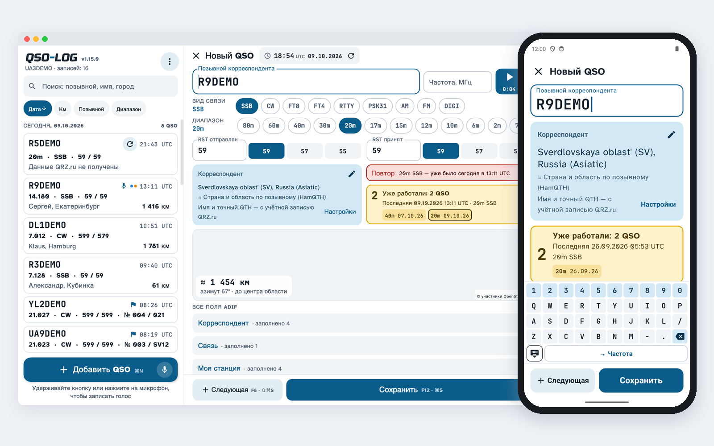
</p>

## Скачать

| Система | Версия | Файл |
|---|---|---|
| Android 8.0 и новее | 0.36.2 | [QSO-LOG-0.36.2.apk](../../releases/tag/v0.36.2) |
| macOS 11 и новее, процессор Apple (M1 и новее) | 1.16.2 | [QSO-LOG-1.16.2-macos-arm64.dmg](../../releases/tag/desktop-v1.16.2) |
| macOS 11 и новее, процессор Intel | 1.16.2 | [QSO-LOG-1.16.2-macos-x64.dmg](../../releases/tag/desktop-v1.16.2) |
| Windows 10 и 11, 64 бит | 1.16.2 | [QSO-LOG-1.16.2-windows-x64.zip](../../releases/tag/desktop-v1.16.2) |
| Linux: Ubuntu 22.04+, Debian 12, Mint | 1.16.2 | [QSO-LOG-1.16.2-linux-amd64.deb](../../releases/tag/desktop-v1.16.2) |

Как установить: [Android](#android) · [macOS](#macos) · [Windows](#windows) · [Linux](#linux).
Есть и [страница программы](https://vladkondratyev.github.io/qso-log/), она сама предложит файл для вашей системы.

## Содержание

- [Первый запуск](#первый-запуск)
- [Новая связь](#новая-связь)
- [Режим соревнований](#режим-соревнований)
- [Работа с клавиатуры](#работа-с-клавиатуры)
- [Журнал](#журнал)
- [Дашборд](#дашборд)
- [История поиска](#история-поиска)
- [Данные о корреспонденте](#данные-о-корреспонденте)
- [Голосовые заметки](#голосовые-заметки)
- [Расстояние и карты](#расстояние-и-карты)
- [Экспорт и импорт](#экспорт-и-импорт)
- [Синхронизация через Google Таблицу](#синхронизация-через-google-таблицу)
- [Справочник и калькуляторы](#справочник-и-калькуляторы)
- [Настройки](#настройки)
- [На компьютере](#на-компьютере)
- [Установка](#установка)
- [Где хранятся данные](#где-хранятся-данные)
- [Что пока не так](#что-пока-не-так)
- [Для разработчиков](#для-разработчиков)

## Первый запуск

Программа спросит три вещи: ваш позывной, где вы находитесь и доступ к QRZ.ru. Вместо QTH-локатора можно написать
город, локатор найдётся сам. Любой шаг можно пропустить и заполнить потом в настройках.

После этого внизу экрана появится кнопка «Добавить QSO». С неё начинается каждая связь.

<p>
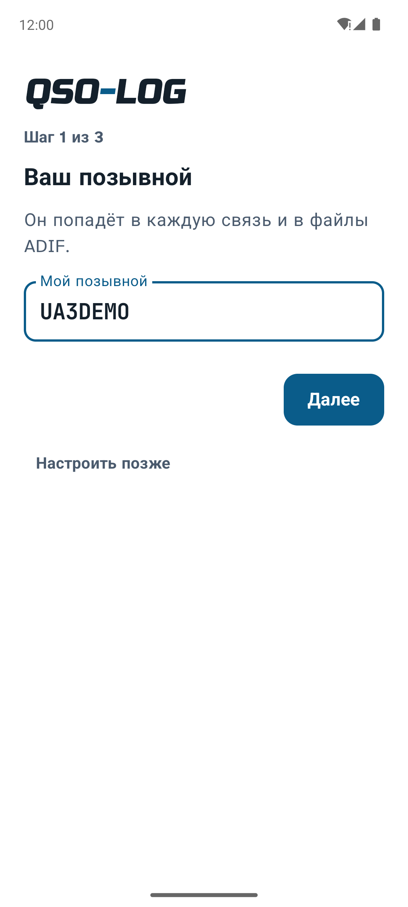
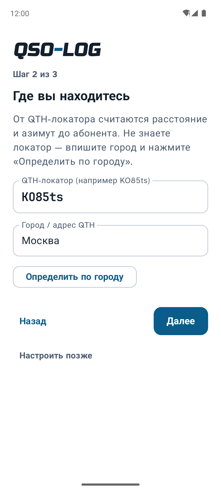
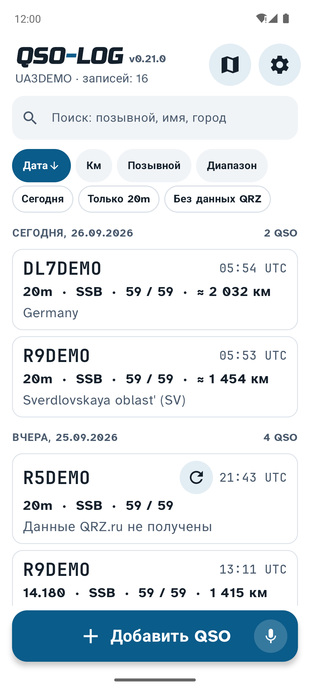
</p>

## Новая связь

Карточка открывается сразу с курсором в поле позывного. Дата и время UTC ставятся сами. Вид связи, диапазон
и частота берутся из прошлой связи, так что обычно остаётся ввести позывной и RST.

Что помогает при вводе:

- Со второй буквы под полем появляются позывные из вашего журнала. Можно выбрать, а не набирать целиком.
- С четвёртой буквы программа ищет корреспондента на QRZ.ru (и на QRZ.com) и заполняет имя, город и локатор.
- Жёлтая плашка показывает, сколько раз вы уже работали с этим позывным и когда последний раз. Если связи были
  на разных диапазонах, ниже идут компактные отметки «40m 25.09.26 · 20m 07.10.26» — последняя связь на каждом
  диапазоне; диапазон открытой карточки обведён.
- Красная плашка «Повтор» появляется, если сегодня уже была связь с ним на том же диапазоне и виде.
  Пригодится в соревнованиях.
- Частоту можно вводить в килогерцах: 14195 превратится в 14.195 МГц. Диапазон по частоте выберется сам.
- Для RST открывается цифровая клавиатура, а под полем есть кнопки частых отчётов: 59, 57, 599, −10 и так далее.
- «＋ Следующая» сохраняет связь и сразу открывает новую карточку на той же частоте. Удобно в пайлапе.

Остальные поля ADIF спрятаны в раскрывающиеся группы: корреспондент, связь, моя станция, прохождение. Время связи
можно брать в момент открытия карточки или в момент сохранения, это выбирается в настройках.

В сохранённой связи внизу три кнопки: удалить, отправить (текстом и с голосовой заметкой, в мессенджер или почту)
и сохранить.

<p>
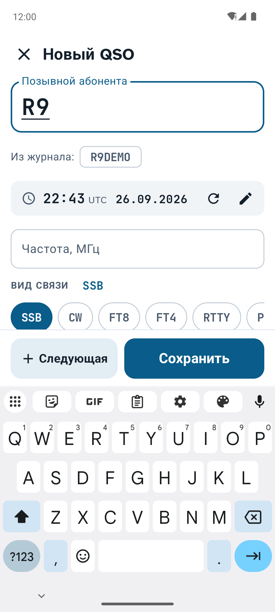
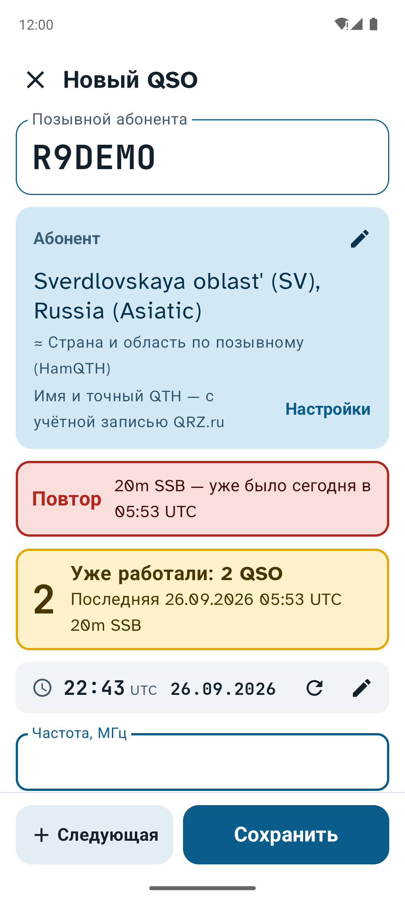
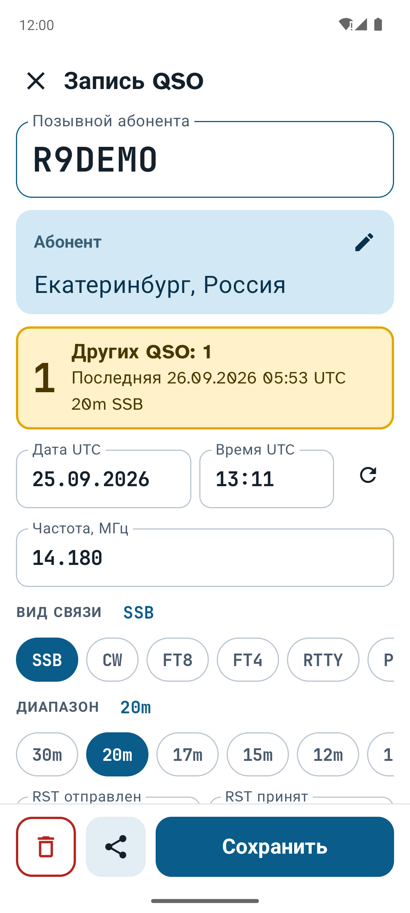
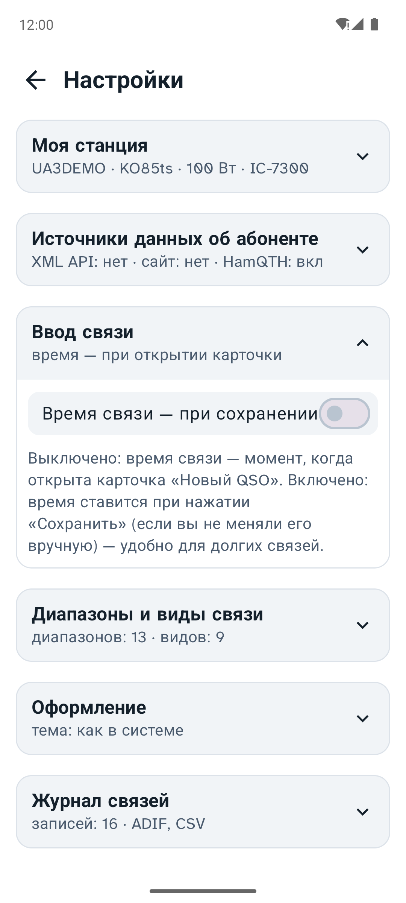
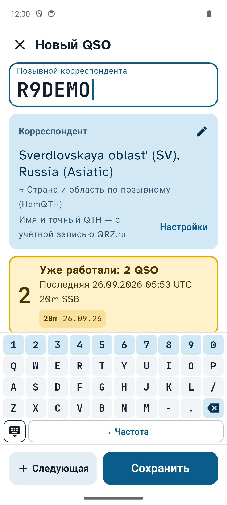
</p>

### Своя клавиатура

Вместо системной клавиатуры можно включить свою, как в контестовых программах: крупные клавиши с цифрами
и латиницей, «/», «-», «.» для частоты и ⌫. Ею набираются позывной, частота и RST, а кнопка под клавишами
переводит к следующему полю: позывной → частота → RST отправлен → RST принят. Имя, город и комментарий
по-прежнему вводятся системной клавиатурой, своя на это время прячется.

Клавиатура бывает обычной и компактной — компактная на треть ниже, и карточке остаётся больше места.
Выбирается в настройках, раздел «Ввод связи»: «Системная», «Своя», «Своя компактная». Выбор запоминается
и действует и в обычной карточке, и в режиме соревнований.

## Режим соревнований

В соревнованиях важна скорость, поэтому есть отдельный режим. Он включается в настройках: блок «Ввод связи»,
переключатель **CONTEST MODE**. При каждом запуске программы режим снова выключен, чтобы случайно не вести
в нём обычный журнал. Пока режим работает, в шапке журнала написано «CONTEST» и что вы передаёте.

Под переключателем выбирается, что передавать каждому корреспонденту:

- **Порядковый номер** — уходит как 001, 002… и после каждой записанной связи увеличивается на единицу.
  Задаётся номер следующей связи.
- **Постоянный код** — одинаковый в каждой связи: район, область, зона (MO69, EU, 16).

«Добавить QSO» в этом режиме открывает упрощённую карточку: позывной, под ним код передан и код принят,
ниже RST. Принятый код может быть любым: 015, MO69, EU, ABCD, 20. RST подставляются сами (59 или 599);
их можно свернуть в одну строку «RST 59 / 59», чтобы не занимали место. Диапазон и вид связи видны в шапке
и меняются нажатием; выбранный диапазон остаётся и для следующих связей. Имя, область и отметка о повторе
показываются одной строкой под позывным.

Внизу карточки — [своя клавиатура](#своя-клавиатура) с крупными клавишами: цифры, латиница, «/» для
переносных позывных, «-» для отчётов в дБ и ⌫ (если держать, стирает знак за знаком). Системная клавиатура не открывается.
Как ввести связь быстрее всего:

1. Наберите позывной и нажмите «→ Код».
2. Наберите принятый код и нажмите «Записать». Связь записана со временем UTC этого момента,
   и сразу открыта следующая карточка с новым номером.

Пока набираете позывной, под ним появляются похожие позывные из журнала — нажмите, чтобы подставить.
После записи на месте «новая связь» коротко написано «✓ позывной записана», а связь появляется в списке
«Последние связи» под карточкой; нажатие на строку открывает её для исправления. В шапке — сколько связей
сделано и сколько за последний час, внизу идут часы UTC.

Если позывной уже был на этом диапазоне и виде связи, кнопка «Записать» после первого нажатия становится
красной — «Записать повтор»: случайный повтор не попадёт в отчёт, а нужный записывается вторым нажатием.

Нажатие на заполненный код или RST выделяет его: следующая клавиша заменяет значение целиком. Второе нажатие
на активное поле выделяет и его содержимое — например, чтобы стереть позывной одним нажатием ⌫. Если удобнее
системная клавиатура, выберите её в настройках («Ввод связи» → «Клавиатура в карточке»): тогда «Далее» на клавиатуре переводит
курсор из позывного в «Код принят», а «Готово» записывает связь.

Без принятого кода связь не запишется: судейская программа такую связь всё равно не засчитает.

Свайп справа налево делает то же, что «Записать». Свайп слева направо возвращает к предыдущим
связям соревнования, чтобы исправить ошибку; обычные записи журнала при этом не открываются. Начатая,
но не записанная карточка не теряется: она снова появится, когда вы долистаете вперёд. Те же переходы есть
на кнопках «‹ назад» и «вперёд ›».

В журнале такие связи отмечены флажком, а рядом с RST видны коды: «№ 005 / 042» — передан и принят.
Коды хранятся в стандартных полях ADIF `STX_STRING` и `SRX_STRING`, из них же их берёт отчёт ЕРМАК или Cabrillo.

На компьютере своей клавиатуры в карточке нет, вместо свайпов — клавиши: Enter переводит из позывного
в «Код принят» и там записывает связь, PgUp и PgDn листают связи соревнования, Esc закрывает карточку.

<p>
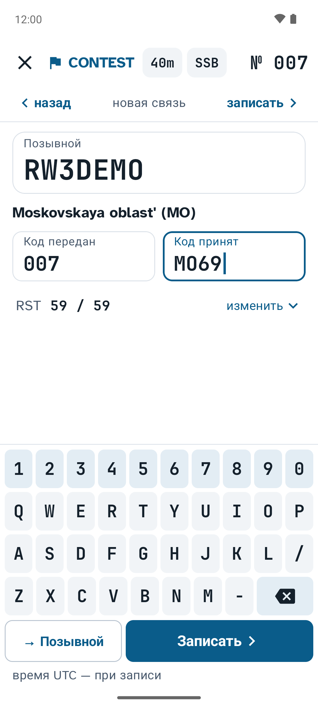
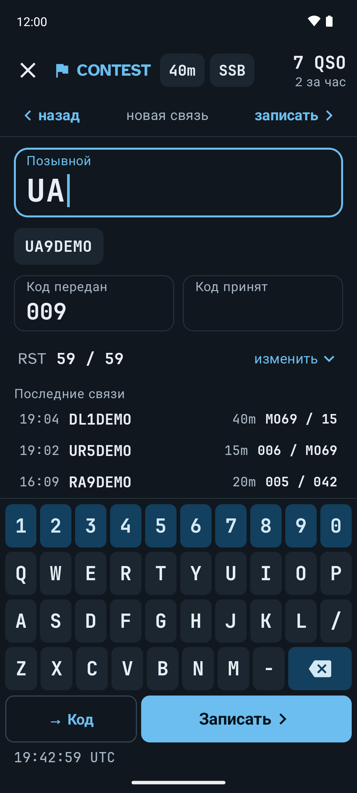
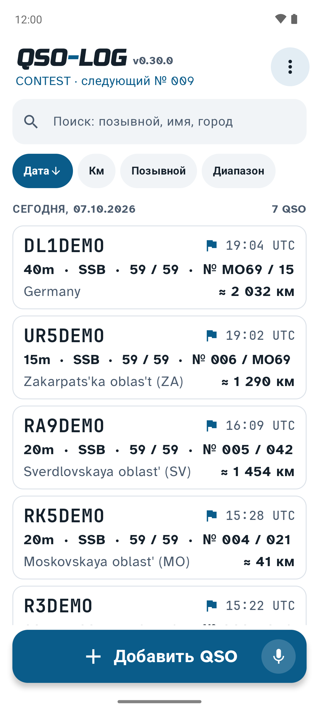
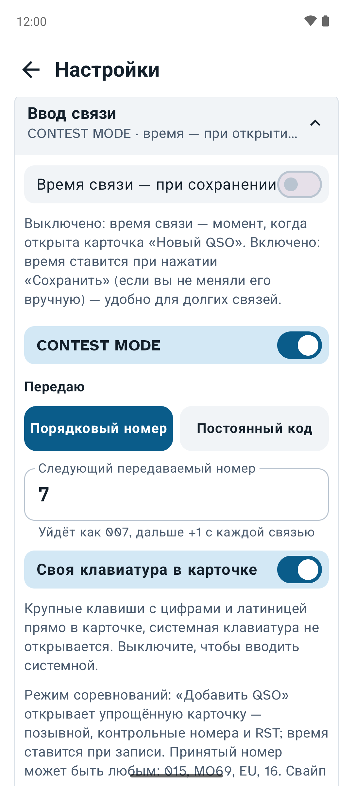
</p>

## Работа с клавиатуры

Весь выезд или контест можно провести, не касаясь экрана: на компьютере — с обычной клавиатуры, на телефоне
или планшете — с внешней (Bluetooth или USB OTG). Удобно в поле: телефон на подставке, маленькая клавиатура
на коленях. Когда внешняя клавиатура подключена, своя экранная клавиатура программы прячется, а курсор сразу
стоит в позывном.

Обычный порядок такой: набрали позывной, нажали **Пробел** или **Enter** — курсор перешёл к частоте или RST
(в контесте — к принятому коду), нажали **Enter** ещё раз — связь записана, открыта новая карточка. Enter в поле
позывного связь никогда не записывает: набрать позывной и нажать Enter, чтобы просто посмотреть, кто это, безопасно. Ошиблись в букве — **↑** в пустом
позывном открывает только что записанную связь, Enter сохраняет её и возвращает к новой карточке.

Клавиши по экранам. На macOS вместо Ctrl — ⌘.

**Везде**

| Клавиша | Что делает |
|---|---|
| Ctrl+N или F9 | новая связь |
| Ctrl+E | исправить последнюю записанную связь |
| Ctrl+F | поиск по журналу; Enter в поиске — новая связь с найденным, ↓ — к списку |
| Ctrl+H | история поиска |
| Ctrl+D · Ctrl+M · Ctrl+, | дашборд · карта QSO · настройки |
| Ctrl+K | CONTEST MODE: включить или выключить |
| Ctrl+R | синхронизировать с Google Таблицей |
| Ctrl+Shift+E | экспорт журнала в ADIF |
| F1 (на Android и Ctrl+/) | список всех клавиш |

**Журнал**

| Клавиша | Что делает |
|---|---|
| ↑ ↓ | по записям (выбранная обведена) |
| PgUp · PgDn · Home · End | на 10 записей, к первой, к последней |
| Enter | открыть запись |
| Пробел · Ctrl+A | отметить запись · отметить все (для экспорта) |
| Delete | удалить запись (сообщение предложит отменить) |
| Esc | снять отметки |

**Карточка связи**

| Клавиша | Что делает |
|---|---|
| Пробел или Enter | из позывного — к частоте или RST (в позывном Enter связь не записывает) |
| Enter | в остальных полях — записать; в новой карточке — записать и открыть следующую |
| Tab · Shift+Tab | следующее и предыдущее поле |
| ↑ | в пустом позывном — исправить последнюю связь |
| Esc | очистить новую карточку (диапазон, вид и частота остаются), второй раз — закрыть |
| F2 · F3 · F4 · F5 | к позывному, частоте, RST отправлен, RST принят |
| F6 | текущее время UTC |
| F7 | голосовая заметка: начать или остановить |
| F8 (на Mac и ⇧⌘S) | сохранить и открыть следующую |
| F12 (на Mac и ⌘S) | сохранить |
| Alt+1…9 · Alt+Shift+1…9 | диапазон · вид связи (n-й из включённых) |
| Shift+Enter | новая строка в комментарии |

**Режим соревнований**

| Клавиша | Что делает |
|---|---|
| Пробел или Enter | из позывного — к принятому коду |
| Enter · F12 | в коде или RST — записать связь; F12 — из любого поля |
| ↑ · PgUp | предыдущая связь (↑ — в пустом позывном) |
| PgDn | следующая связь |
| Esc | очистить карточку, второй раз — закрыть |

**История поиска**

| Клавиша | Что делает |
|---|---|
| ↑ ↓ · Enter | по записям · открыть с картой |
| Пробел · Ctrl+A | отметить запись · отметить все |
| F | в избранное или из избранного |
| E | изменить (отмеченные — все сразу) |
| N | новый QSO с этой станцией |
| M | все на карте или списком |
| Delete | удалить из истории |
| Esc | назад |

**Дашборд**: 1 · 2 · 3 · 4 — 7 дней, 30 дней, год, всё время; Esc — назад.

На маленьких клавиатурах без F-клавиш выручают команды прямо в поле позывного. Вместо позывного наберите
команду и нажмите Enter или Пробел — программа переключит диапазон, вид связи или частоту и очистит поле:

| Набрать | Что произойдёт |
|---|---|
| `20m` или `20`, `70cm` или `70` | диапазон |
| `CW`, `SSB`, `FT8`, `FM`… (`USB` и `LSB` — тоже SSB) | вид связи |
| `14195` или `14.195`, `7074` | частота в килогерцах или мегагерцах, диапазон выберется сам |

С позывным такая команда не спутается: в позывном всегда есть и буквы, и цифры.

На телефоне список клавиш открывается и из меню ⋮ → «Внешняя клавиатура»; когда клавиатура подключена, сочетания
видны и прямо в меню ⋮. На Mac F-клавиши нажимаются вместе
с fn, если в настройках клавиатуры не включено «Использовать F1, F2 и т. д. как стандартные функциональные клавиши».

<p>
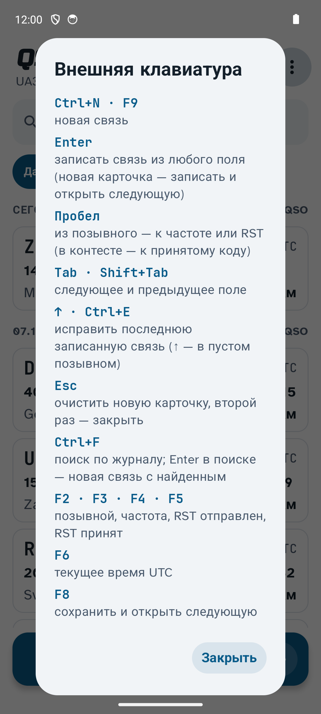
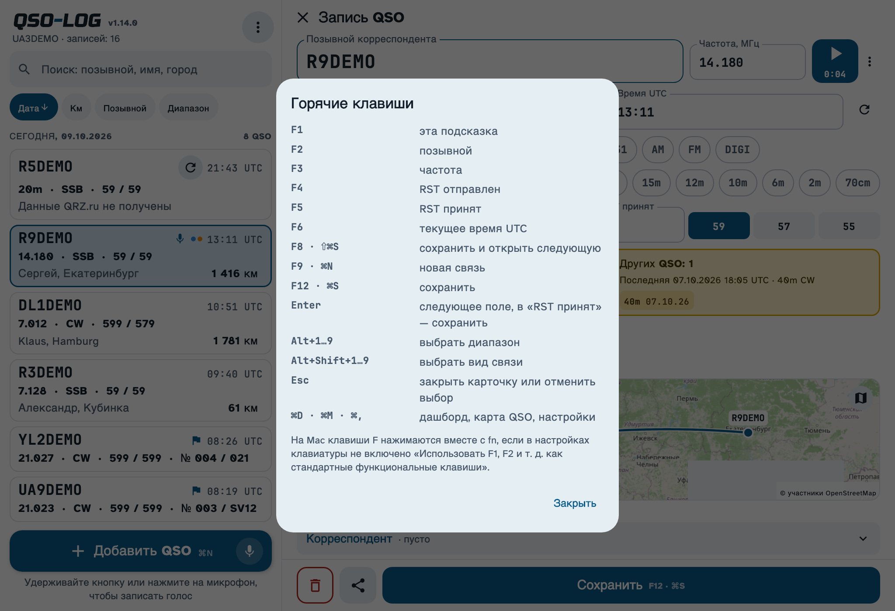
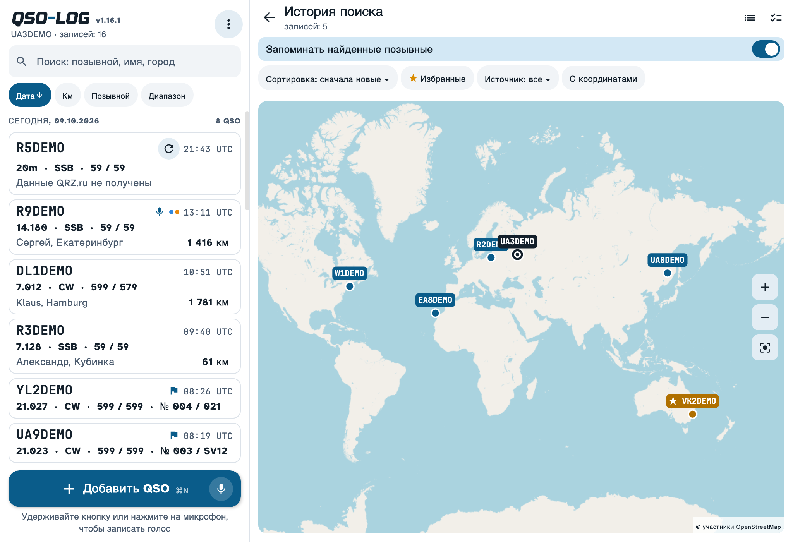
</p>

## Журнал

Связи сгруппированы по дням, свежие сверху. В строке видно позывной, время, частоту, вид, RST, расстояние,
имя и город. Значок микрофона значит, что у связи есть голосовая заметка.

- **Поиск** работает по позывному, имени, городу, локатору и комментарию. Если такого позывного в журнале нет,
  программа поищет его на QRZ.ru и сразу откроет новую карточку с найденными данными.
- Если поиск нашёл одного знакомого корреспондента, под строкой поиска видно, на каких диапазонах с ним уже есть
  связи и когда была последняя на каждом. «Добавить QSO» откроет карточку уже с его именем и городом.
- **Сортировка**: по дате, расстоянию, позывному или диапазону. Второе нажатие на ту же кнопку меняет порядок.
- Связь, сохранённая без интернета, помечена кнопкой ⟳. Нажмите её, когда сеть появится, и данные с QRZ.ru допишутся.
- Несколько связей выбираются долгим нажатием (на компьютере ещё Ctrl-щелчком или ⌘-щелчком).
  Выбранные можно выгрузить в файл кнопкой «Экспорт».
- Удалить связь можно только из её карточки. Программа переспросит, а после удаления ещё можно нажать «Отменить».
- Кнопка «⋮» в правом верхнем углу открывает меню: настройки, дашборд, карта QSO, справка и калькуляторы.

<p>
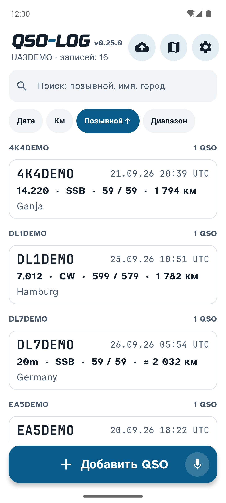
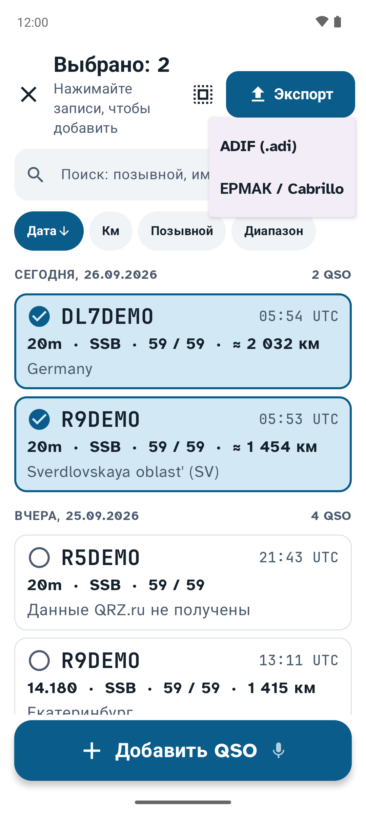
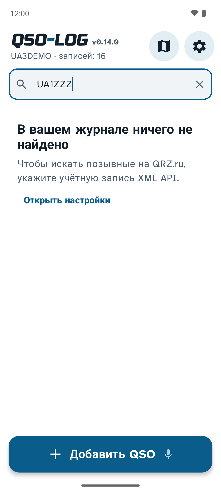
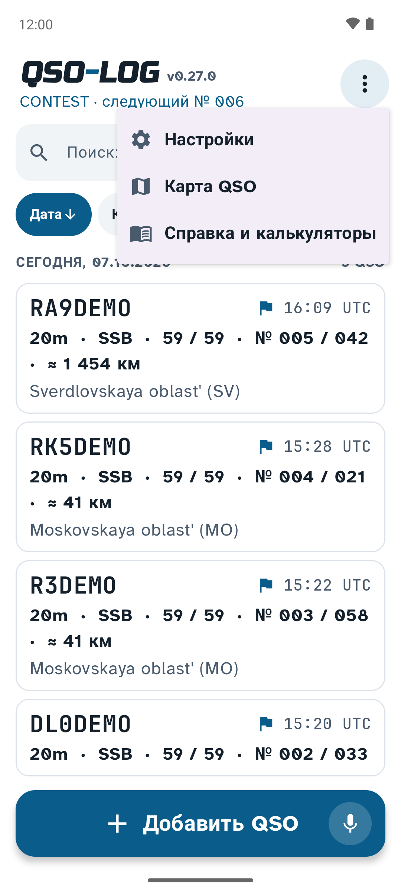
</p>

## Дашборд

Статистика журнала в графиках: меню «⋮» → «Дашборд». Всё считается на телефоне, без интернета.

Сверху одна строка параметров, они действуют на все графики сразу:

- период: 7 дней, 30 дней, год или всё время;
- диапазон и вид связи: все или какой-то один;
- «Контест» — только связи [режима соревнований](#режим-соревнований) (кнопка видна, если такие связи есть).

Что показывает дашборд:

| Блок | Что там | Формы |
|---|---|---|
| Сводка | QSO, разных позывных, стран DXCC и континентов, активных дней и среднее за день, рекорд дня, самая дальняя связь | числа |
| Связи по времени | сколько связей по дням, неделям или месяцам (выбирается сам или вручную), пустые дни тоже видны | столбцы, линия, нарастающий итог, столбцы с разбивкой по диапазонам |
| Диапазоны | связи на каждом диапазоне, по порядку частот | полосы или кольцо с долями |
| Виды связи | SSB, CW, FT8… | полосы или кольцо с долями |
| Когда вы в эфире | тепловая карта: день недели × час UTC | — |
| Чаще всего | 10 позывных, с кем больше всего связей | полосы |
| Страны | все страны DXCC журнала: связи, разных позывных, континент, диапазоны, последняя связь; по числу связей, по алфавиту или недавние | список с полосами |
| Континенты | по префиксу позывного, по справочнику cty.dat | полосы |
| Расстояние | сколько связей до 100 км, 100–500 км и так далее до 10 000 км и дальше | полосы |

Нажатие на столбец, точку или клетку показывает точное число. Графики в цветах программы: основной — фирменный
синий QSO-LOG, дальше янтарный, зелёный, фиолетовый и розовый. Цвета закреплены за значением: самый частый
диапазон журнала остаётся синим при любом фильтре. Палитра проверена на различимость при нарушениях цветового
зрения, в светлой и тёмной теме.

<p>
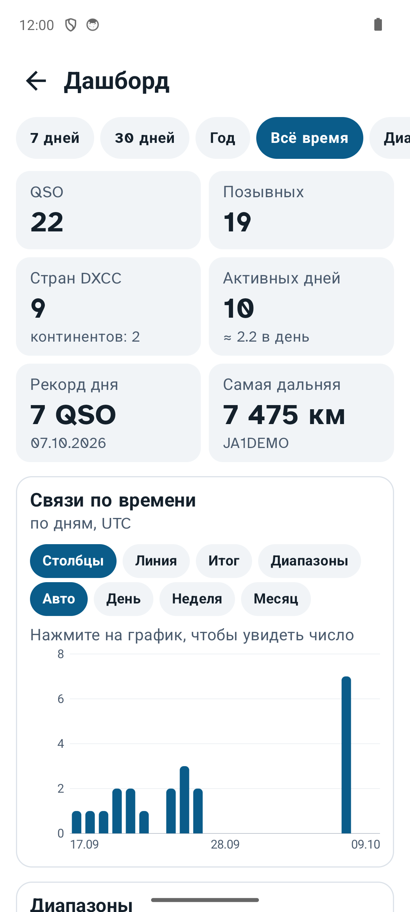
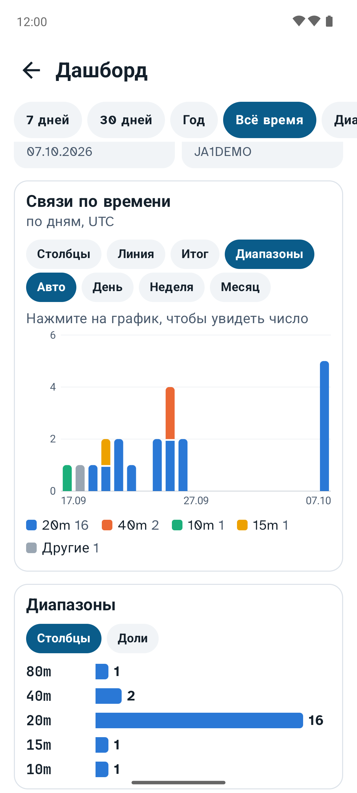
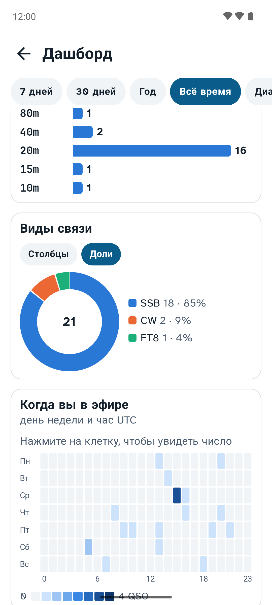
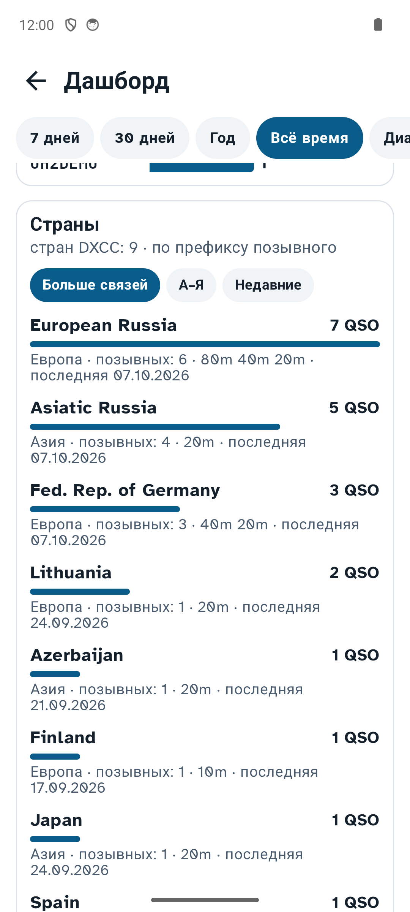
</p>

## История поиска

Меню ⋮ → «История поиска». Сюда сами попадают все позывные, которые вы искали — в поиске журнала или в карточке
«Новый QSO». Это кэш поиска: связи из него не появляются и в подсчёте QSO он не участвует. Если со станцией уже есть
связи, в строке написано «в журнале: N QSO». У каждой записи видно, откуда взяты данные: QRZ.ru, сайт QRZ.ru,
QRZ.com или HamQTH, и когда.

История включается переключателем прямо в меню ⋮ или на её экране; при включении программа предупредит, для чего
она нужна. Главное — работа без интернета: если QRZ.ru или QRZ.com не отвечают, карточка новой связи заполнится
из истории (в карточке будет пометка «Из истории поиска»). Записи хранятся только на устройстве.

Что можно делать:

- открыть запись: карта с трассой от вас до корреспондента, расстояние, азимут и обратный азимут, имя, QTH,
  локатор, RDA, зоны; кнопка «Новый QSO» создаёт связь с этими данными;
- отметить звёздочкой — избранные всегда вверху списка;
- сортировать (сначала новые, по позывному, ближе, по стране) и фильтровать: только избранные, по источнику,
  только с координатами, поиск по тексту;
- посмотреть все записи сразу на карте, избранные выделены янтарным; нажатие на метку открывает запись;
- изменить запись или сразу несколько (долгое нажатие или кнопка выбора): заполненные поля поменяются у всех
  выбранных, пустые останутся как были; удалить одну или несколько.

<p>
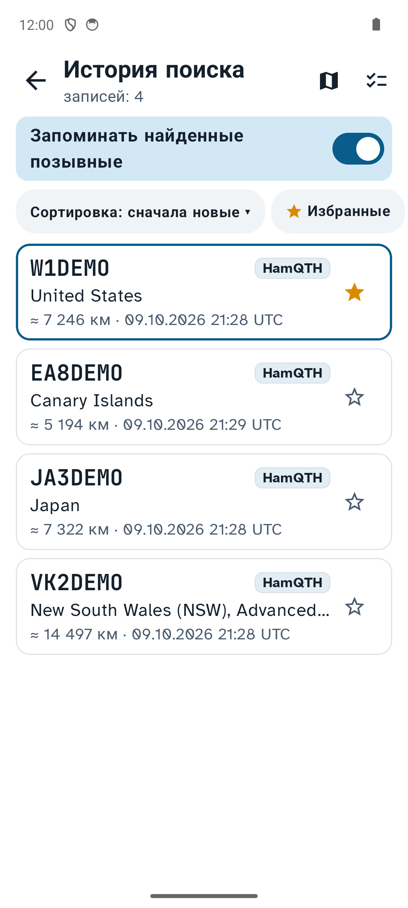
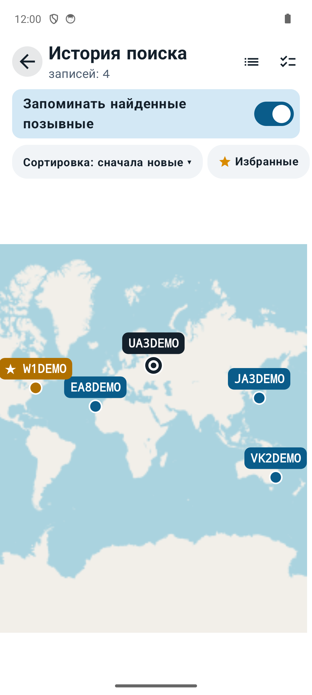
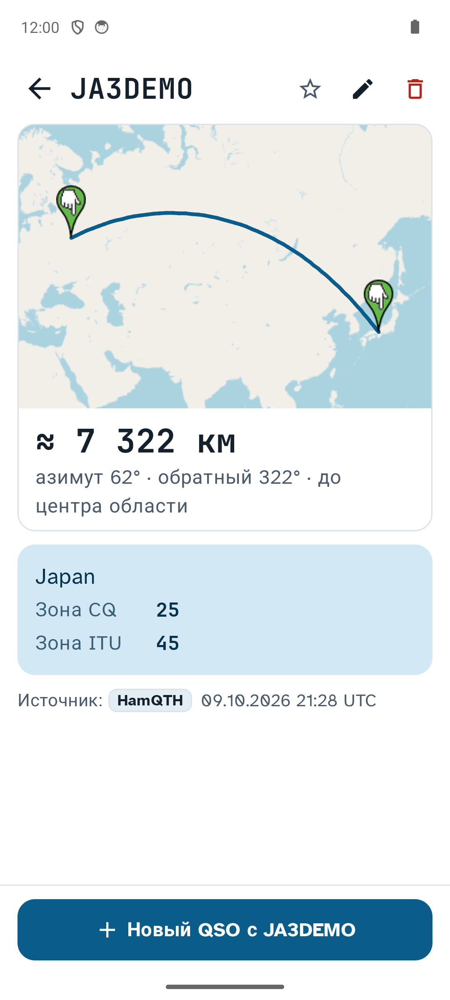
</p>

## Данные о корреспонденте

Имя, город и координаты корреспондента программа ищет в четырёх местах, по очереди. Все они настраиваются в одном
блоке «Данные о корреспонденте».

**1. XML API QRZ.ru.** Основной способ, так QRZ.ru предлагает подключать программы-журналы. Логин и пароль
для API выдаёт сам QRZ.ru:

1. Войдите на qrz.ru. Ваш позывной должен быть в Callbook.
2. Откройте «Личные данные», внизу раздел «XML API», кнопка «Создать аккаунт»
   ([прямая ссылка](https://www.qrz.ru/personal/settings/apiuser)).
3. Укажите позывной и название программы: QSO-LOG.
4. Логин и пароль придут через какое-то время. Это не пароль от сайта.

Доступ дают на постоянные позывные радиолюбителей и наблюдателей. Подробности в
[справке QRZ.ru](https://www.qrz.ru/help/api/xml).

XML API не отдаёт район RDA. Для российского позывного программа после ответа API открывает страницу
позывного на qrz.ru (одна страница на позывной, работает и без учётной записи сайта) и берёт оттуда район RDA
и область: они видны в карточке рядом с локатором и попадают в ADIF (`CNTY`, `STATE`).

**2. Учётная запись сайта QRZ.ru.** Запасной вариант, если доступа к API нет. Вы указываете e-mail и пароль
от qrz.ru, программа открывает страницу позывного и берёт оттуда имя, город, область и район RDA. Если указаны
и API, и сайт, сначала спрашивается API. Имейте в виду: если сайт поменяет вёрстку, этот способ сломается,
а каждый запрос засчитывается корреспонденту как просмотр его страницы.

**3. Сайт QRZ.com.** Для зарубежных позывных, которых нет на QRZ.ru. Вы указываете логин QRZ.com (позывной
или e-mail) и пароль, подойдёт бесплатная учётная запись. Программа входит на qrz.com и читает страницу позывного:
имя, город, страну, локатор, координаты и зоны CQ/ITU. QRZ.com спрашивается, если QRZ.ru позывного не знает
или не ответил. Ограничения те же, что у сайта QRZ.ru, а учётные записи с двухфакторным входом не поддерживаются.

**4. HamQTH.** Работает без регистрации, но знает только страну, область и зоны CQ/ITU. Расстояние в этом случае
считается до центра области и помечается знаком «≈». Если не нужен, выключите в настройках.

Без интернета связь всё равно сохранится, данные можно будет подтянуть потом кнопкой ⟳.

<p>
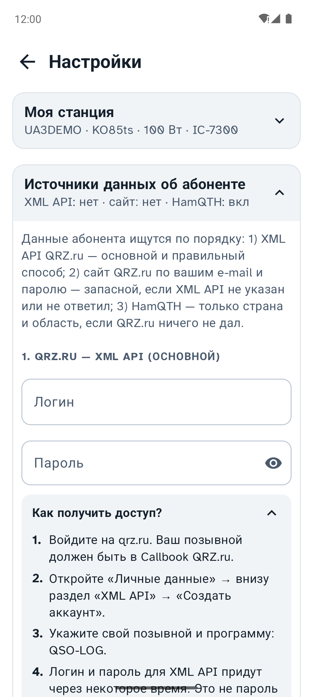
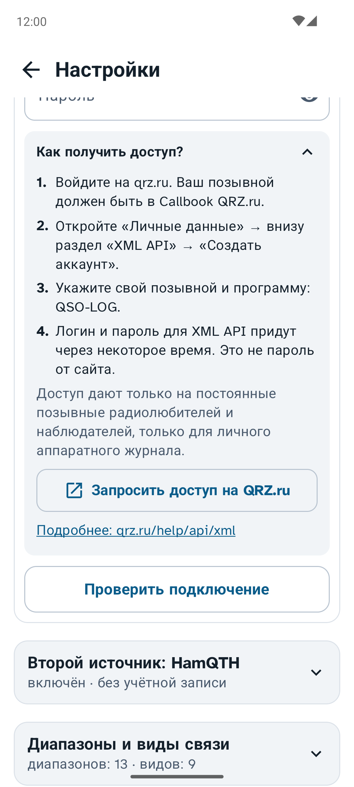
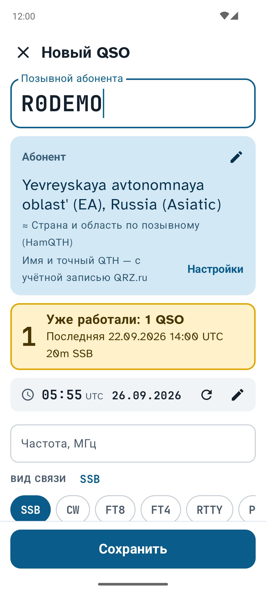
</p>

## Голосовые заметки

Иногда проще наговорить, чем набрать. Запись можно начать тремя способами:

- удерживать «Добавить QSO»: пока держите, идёт запись, отпустили — открылась карточка с заметкой;
- нажать на микрофон справа на той же кнопке, а потом нажать ещё раз, чтобы остановить;
- нажать на микрофон в заголовке новой карточки (он появляется, когда корреспондент найден на QRZ.ru).
  Запись идёт до кнопки «Стоп» или до сохранения связи.

Заметка проигрывается кнопкой ▶ рядом с позывным. В меню ⋮ её можно отправить вместе с данными связи или удалить.

<p>
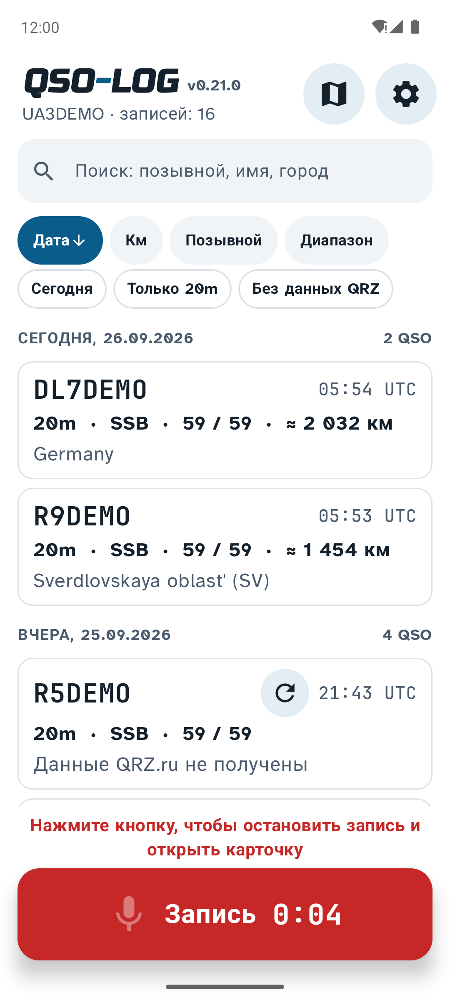
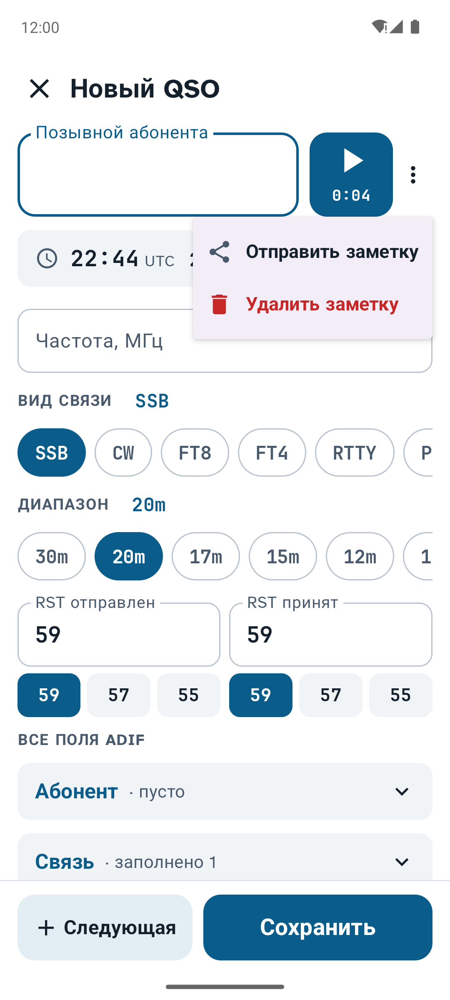
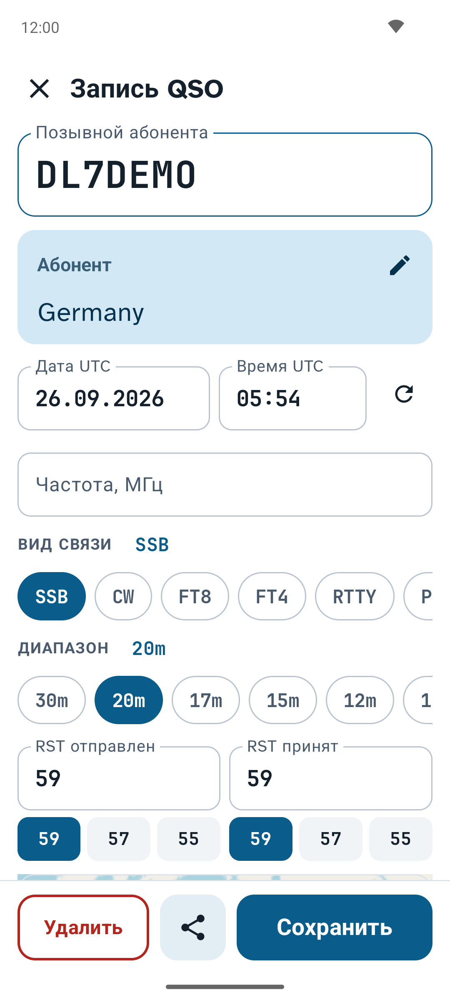
</p>

## Расстояние и карты

Расстояние и азимут считаются от вашего QTH-локатора. В карточке связи под ними нарисована трасса по дуге большого
круга, кнопка «Карта» открывает её на весь экран. Если вы работаете из экспедиции, локатор можно поменять
в самой связи.

Пункт «Карта QSO» в меню «⋮» показывает всех ваших корреспондентов на OpenStreetMap. Нажатие на точку открывает
последнюю связь с этой станцией.

<p>
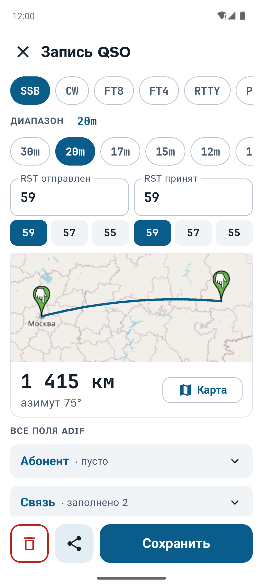
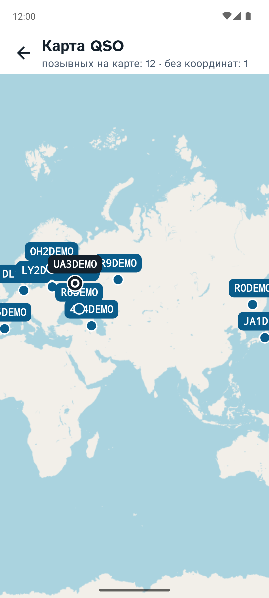
</p>

## Экспорт и импорт

Поддерживаются три формата:

- **ADIF** (.adi) понимают LogHX, UR5EQF, HamLog, N1MM, QRZ.com и другие журналы. Через ADIF же удобно переносить
  лог между телефоном и компьютером. Кодировку файла выбираете при экспорте: UTF-8 подходит для большинства программ
  и сайтов, Windows-1251 нужна для LogHX и UR5EQF. Программа запоминает ваш выбор. При импорте кодировка
  определяется сама, и все поля файла сохраняются, даже незнакомые.
- **CSV** открывается в Excel, разделитель — точка с запятой.
- **ЕРМАК** ([ermak.srr.ru](https://ermak.srr.ru/)) для российских соревнований и **Cabrillo 3.0** для
  международных. Перед сохранением программа спросит код соревнования, категорию и район RDA.
  Контрольные номера берутся из карточки, а если их нет, ставятся по порядку: 001, 002… Если в журнале есть
  связи [режима соревнований](#режим-соревнований), в диалоге включена галочка «Только связи контест-режима»:
  обычные записи без номеров в отчёт не попадут.

Весь журнал выгружается из настроек, блок «Журнал связей». Только нужные связи — через выбор в журнале
и кнопку «Экспорт».

Перед сохранением программа задаёт два вопроса:

1. Брать только новые связи или все. «Новые» — это те, которые в этот формат ещё не выгружались. По умолчанию
   выбраны они, так что в следующий раз не придётся искать, что уже отправлено.
2. Ставить ли в карточках отметку об экспорте.

Отметки видны в самом низу карточки связи, с датой и временем, отдельно для каждого формата. Если связь надо
выгрузить ещё раз, отметку можно снять. В журнале у выгруженных связей рядом со временем стоят цветные точки:
синяя — ADIF, зелёная — CSV, оранжевая — ЕРМАК или Cabrillo.

У каждой связи есть свой постоянный номер — GUID. Он записывается в ADIF (поле `APP_QSOLOG_UID`) и CSV (столбец `uid`),
поэтому связь, перенесённая файлом на другое устройство, остаётся той же связью. При импорте повторы пропускаются:
сначала по GUID, а для файлов из других программ — по позывному, минуте, диапазону и виду.

<p>
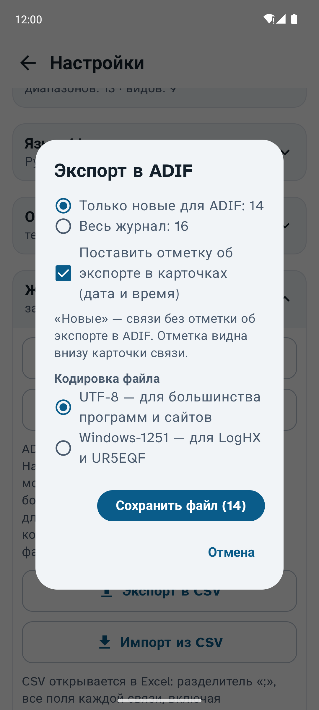
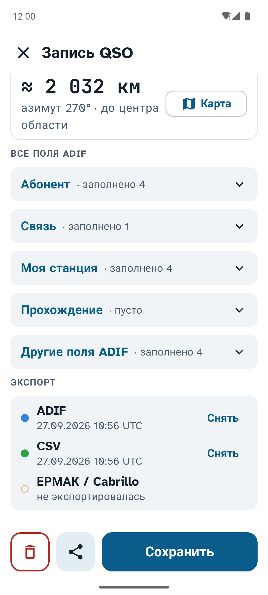
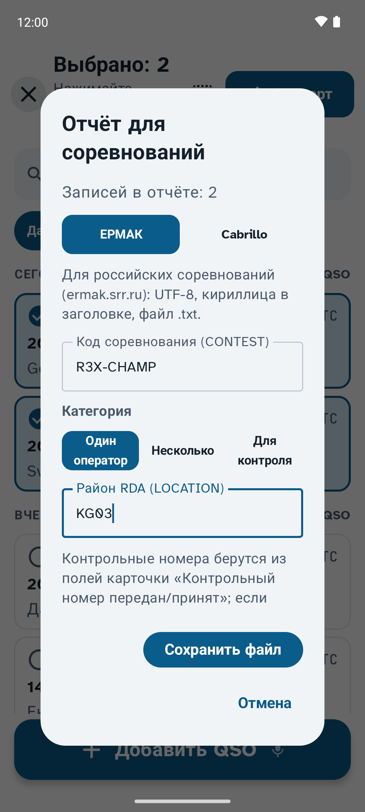
</p>

## Синхронизация через Google Таблицу

Один журнал на двух-трёх устройствах: телефон, планшет, компьютер. Связи собираются в вашей собственной
Google Таблице, программа обменивается с ней по кнопке «Синхронизировать» — сама в фоне она ничего не отправляет.

Писать в таблицу программам Google разрешает только через вход в аккаунт или через скрипт в самой таблице.
QSO-LOG использует скрипт: вход в Google в программе не нужен, а таблица остаётся вашей. Настройка — один раз,
минут пять, удобнее на компьютере:

1. Откройте свою Google Таблицу, можно новую и пустую.
2. Меню «Расширения → Apps Script». Сотрите всё в окне редактора и вставьте код скрипта. Код показан в настройках
   программы (блок «Журнал связей», раздел «Синхронизация через Google Таблицу»), кнопка «Скопировать код скрипта»
   кладёт его в буфер обмена. Тот же код лежит в репозитории:
   [qsolog-sheet-sync.gs](shared/src/main/resources/qsolog-sheet-sync.gs).
3. Нажмите «Сохранить», затем «Начать развёртывание → Новое развёртывание», тип — «Веб-приложение».
   Укажите «Запуск от имени: я» и «У кого есть доступ: все», нажмите «Начать развёртывание» и разрешите доступ
   своему аккаунту. Google предупредит, что приложение не проверено: это ваш собственный скрипт,
   нажмите «Дополнительные настройки → Перейти».
4. Скопируйте «URL веб-приложения» — он заканчивается на `/exec` — и вставьте в поле «Адрес скрипта».
   Рядом с полем есть кнопка «Вставить из буфера».
5. Нажмите «Синхронизировать». Введите тот же адрес на других устройствах и тоже нажмите «Синхронизировать».

Первая синхронизация объединяет журналы. Если одна и та же связь уже была на двух устройствах (например,
журнал переносили через ADIF), она склеивается в одну строку. Дальше нажимайте «Синхронизировать» на любом
устройстве — в настройках или в меню ⋮ журнала. Под кнопкой видно, когда была последняя синхронизация и сколько
связей отправлено и получено.

Как это устроено:

- В таблице появляется лист «QSO-LOG». В первой строке — названия полей и их описание, дальше по строке на связь.
  Все значения хранятся как текст, поэтому «001» остаётся «001», а частота не превращается в дату.
- Если связь изменили на двух устройствах, остаётся более поздняя правка.
- Связи можно править прямо в таблице: изменённая строка придёт на устройства при следующей синхронизации.
  Строку, добавленную в таблицу вручную, программа тоже заберёт.
- Связь, удалённая на одном устройстве, удаляется и на остальных. В таблице её строка остаётся с отметкой `Y`
  в столбце `deleted`. Чтобы удалить связь из таблицы, поставьте `Y` сами — строку не удаляйте, иначе устройства
  об этом не узнают.
- Голосовые заметки остаются на своём устройстве. «Удалить весь журнал» очищает только это устройство:
  при следующей синхронизации связи вернутся из таблицы.
- Адрес скрипта работает как пароль: кто его знает, может менять журнал. Открывать саму таблицу по ссылке не нужно.

<p>
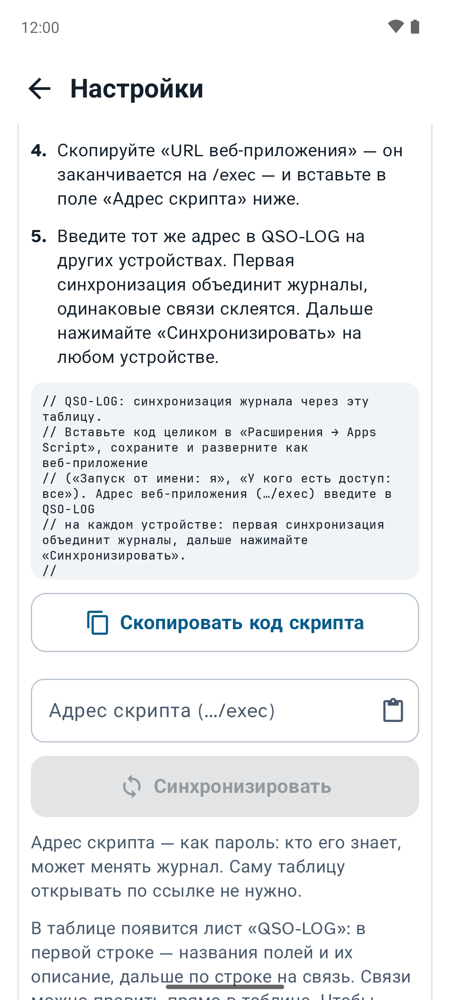
</p>

## Справочник и калькуляторы

На телефоне справочник открывается из меню «⋮» в журнале: пункт «Справка и калькуляторы». На компьютере —
из того же меню «⋮» над журналом или из меню «Файл». Всё работает без интернета.

| Вкладка | Что там |
|---|---|
| Частоты РФ | любительские полосы по решению ГКРЧ № 10-07-01, от 2200 м до 250 ГГц |
| План и активность | упрощённый план IARU Region 1, частоты FT8, FT4, WSPR, SSTV, QRP, APRS, МКС; какой маяк NCDXF сейчас в эфире |
| Морзе | латиница, кириллица, цифры и знаки; нажатие на знак проигрывает его звук; у русских букв — латинская буква с тем же сигналом (W/В, Q/Щ) и напев для заучивания («ай-ДА», «БА-ки-те-кут») |
| Позывные | фонетический алфавит ICAO и русская таблица |
| Коды | Q-коды, сокращения CW, шкала RST |
| Уровни | пересчёт Вт, dBm и dBW, расчёт ЭИИМ, шкала S-метра |
| Кабели | потери в кабеле на нужной частоте и длине, таблица затухания популярных кабелей, КСВ |
| Антенны | длина волны, диполь, GP, рамка, четвертьволновый отрезок кабеля |
| Префиксы | страна, зоны и расстояние по позывному; для России — область и код RDA |
| Прохождение | что значат SFI, A и K; часовые пояса России |

Откуда данные: решение ГКРЧ № 10-07-01, таблица кабелей [DD1US](https://www.dd1us.de), файл стран cty.dat
от AD1C ([country-files.com](https://www.country-files.com)), список субъектов РФ с сайта
[СРР](https://srr.ru/spisok-subektov-rossijskoj-federats/). Это справочные значения. Для важных решений сверяйтесь
с документами и паспортом своего кабеля.

<p>

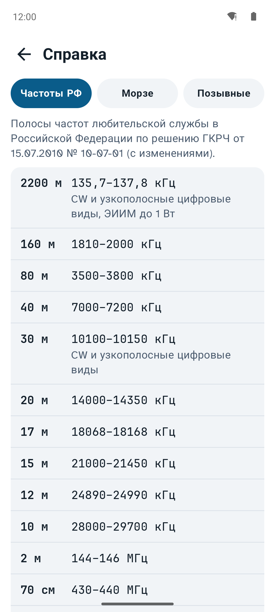
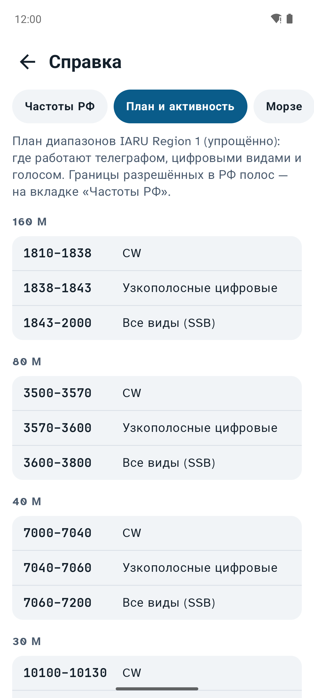
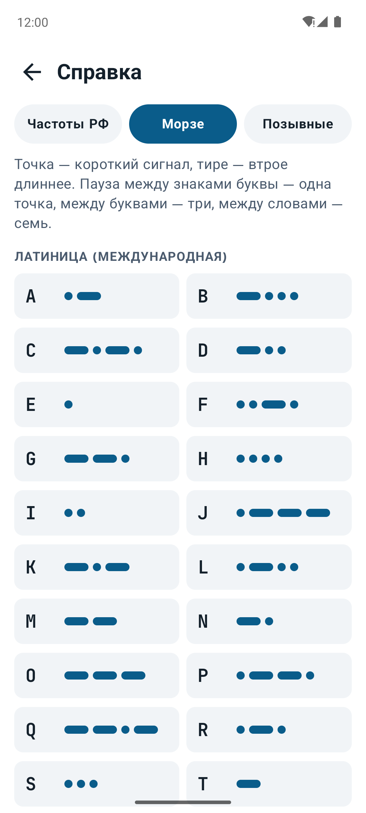
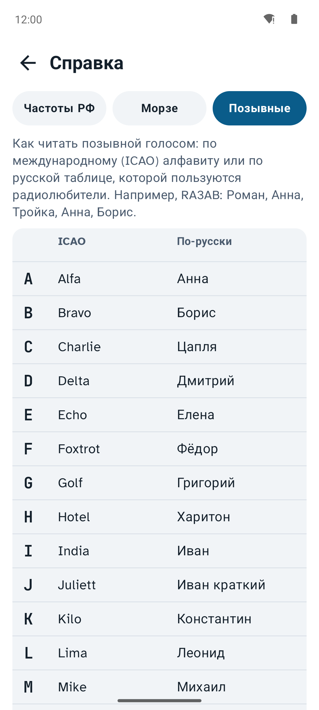
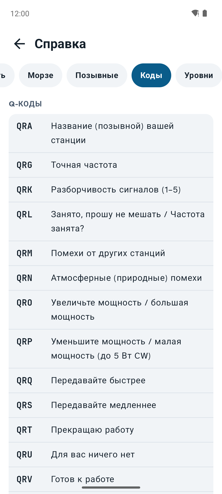
</p>
<p>
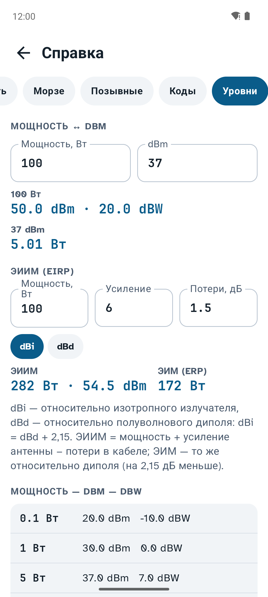
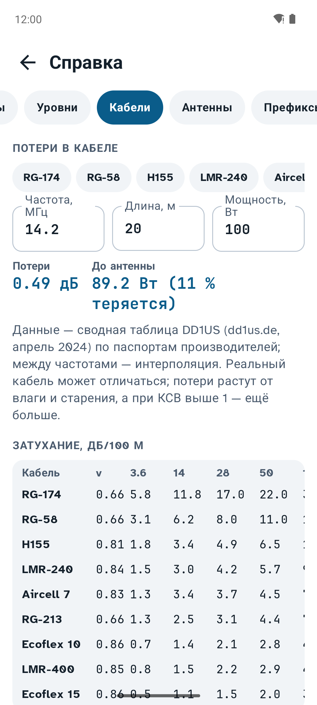
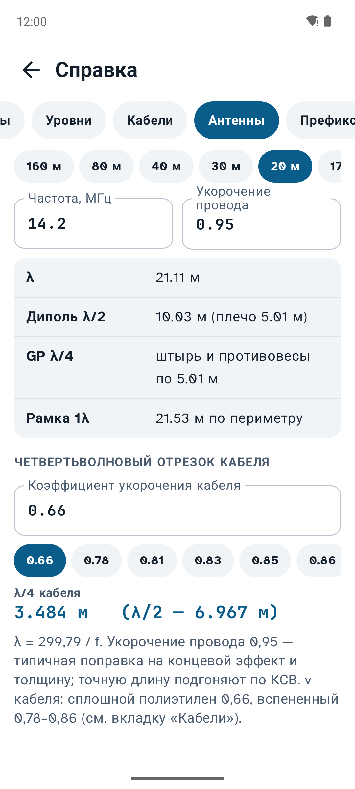
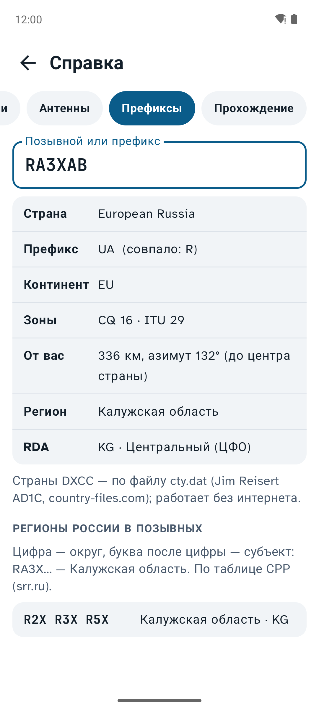
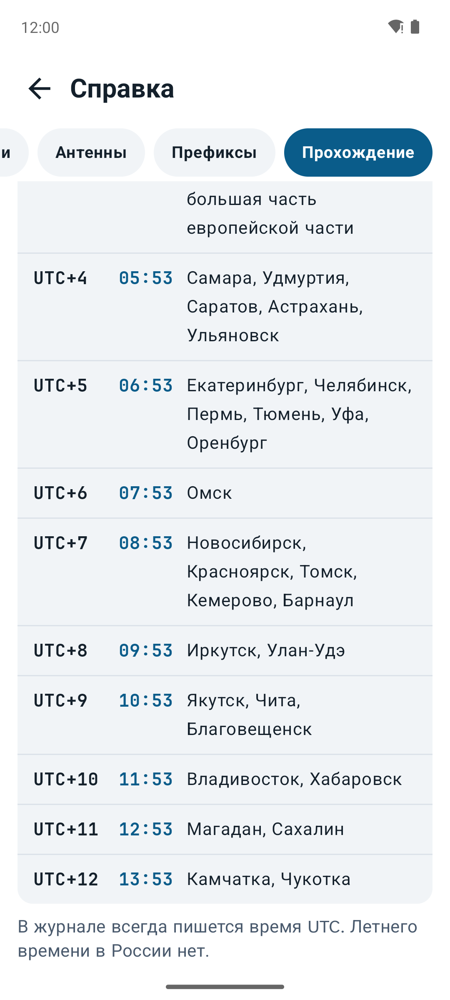
</p>

## Настройки

Настройки разбиты на блоки. У каждого в заголовке коротко написано, что сейчас выбрано, так что раскрывать всё
подряд не нужно.

- **Моя станция**: позывной, QTH-локатор, город. Кнопка «Определить локатор» найдёт его по QRZ.ru или по городу.
  Здесь же мощность, трансивер, антенна и оператор, которые подставятся в новые связи.
- **Данные о корреспонденте**: QRZ.ru, QRZ.com и HamQTH, см. [выше](#данные-о-корреспонденте).
- **Ввод связи**: когда ставить время связи и [режим соревнований](#режим-соревнований) CONTEST MODE.
- **Диапазоны и виды связи**: какие кнопки показывать в карточке. Если оставить один диапазон или один вид,
  кнопок не будет, он просто подпишется.
- **Язык**: как в системе, русский или английский. Меняется сразу, перезапуск не нужен.
- **Оформление**: светлая, тёмная или как в системе.
- **Журнал связей**: экспорт и импорт, [синхронизация через Google Таблицу](#синхронизация-через-google-таблицу),
  удаление всего журнала.

В самом низу — номер версии и кнопка «Проверить обновления». Если на GitHub есть версия новее,
программа покажет, что в ней изменилось, и предложит скачать.

<p>
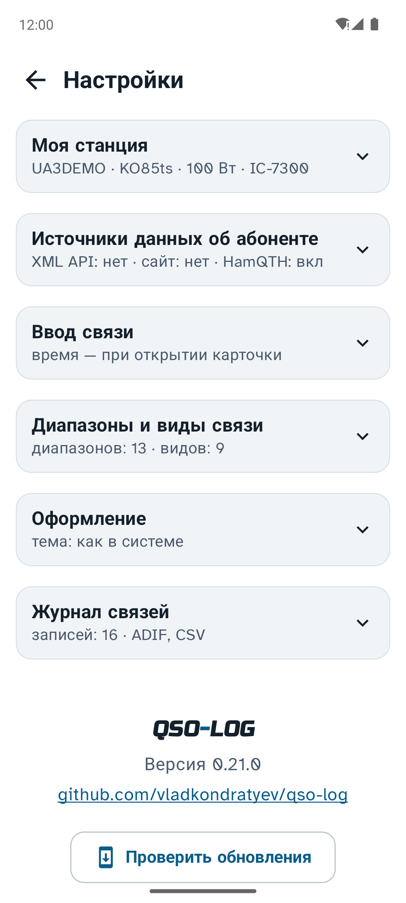


</p>

<p>


</p>

<details>
<summary>Ещё скриншоты с телефона</summary>
<p>


</p>
</details>

Все позывные на скриншотах вида `*DEMO` выдуманы.

## На компьютере

Версия для компьютера умеет всё то же, что и Android: поиск на QRZ.com, режим соревнований, дашборд, синхронизацию
через Google Таблицу. Окно разделено на две части: слева журнал, справа карточка связи, карта, дашборд или настройки.
С версии 1.14.0 шрифт и кнопки на компьютере примерно на 30% мельче, чем раньше: в окне помещается больше.

<p>


</p>

Связь можно ввести, не трогая мышь: все клавиши — в разделе [Работа с клавиатуры](#работа-с-клавиатуры), в программе их показывает F1.

Несколько отличий от телефона:

- Голосовые заметки пишутся в WAV (на телефоне в M4A, файлы там в несколько раз меньше).
- «Отправить» копирует данные связи в буфер обмена. Если есть заметка, она сохраняется в выбранную папку
  вместе с текстовым файлом.
- Экспорт, импорт и справочник есть ещё в меню «Файл».

<details>
<summary>Ещё скриншоты с компьютера</summary>
<p>


</p>
</details>

## Установка

Новую версию на любой системе ставьте поверх старой. Журнал и настройки сохранятся.

### Android

1. Скачайте `QSO-LOG-0.36.2.apk` со [страницы релиза](../../releases/tag/v0.36.2).
2. Откройте файл на телефоне. Android может попросить разрешить установку из этого источника — разрешите.

### macOS

1. Скачайте со [страницы релиза](../../releases/tag/desktop-v1.16.2) файл для своего Mac:
   - `QSO-LOG-1.16.2-macos-arm64.dmg`, если процессор Apple (M1 и новее);
   - `QSO-LOG-1.16.2-macos-x64.dmg`, если Intel.

   Узнать, какой у вас, можно в меню  → «Об этом Mac».
2. Откройте DMG и перетащите QSO-LOG в «Программы».
3. При первом запуске macOS скажет, что не может проверить разработчика: программа не подписана сертификатом Apple.
   Откройте «Системные настройки» → «Конфиденциальность и безопасность» и внизу нажмите «Всё равно открыть».
4. Когда вы первый раз запишете голосовую заметку, macOS спросит доступ к микрофону.

### Windows

1. Скачайте `QSO-LOG-1.16.2-windows-x64.zip` со [страницы релиза](../../releases/tag/desktop-v1.16.2).
2. Распакуйте архив целиком, например в «Документы». Прямо из архива программа не запустится.
3. Запустите `QSO-LOG.exe`. Java ставить не нужно, она уже в папке.
4. Windows может показать «Система Windows защитила ваш компьютер», потому что программа не подписана.
   Нажмите «Подробнее» и «Выполнить в любом случае».
5. Если заметки не записываются, разрешите доступ к микрофону: «Параметры» → «Конфиденциальность и защита» →
   «Микрофон» → «Разрешить классическим приложениям доступ к микрофону».

Чтобы обновить программу, замените папку. Подробнее — в `README.txt` внутри архива.

### Linux

1. Скачайте `QSO-LOG-1.16.2-linux-amd64.deb` со [страницы релиза](../../releases/tag/desktop-v1.16.2).
2. Установите двойным щелчком или из терминала:
   ```bash
   sudo apt install ./QSO-LOG-1.16.2-linux-amd64.deb
   ```
3. QSO-LOG появится в меню приложений, в разделе «Любительское радио».

Удалить: `sudo apt remove qso-log`. Журнал в домашней папке при этом останется.

## Где хранятся данные

Журнал, настройки и заметки лежат только на вашем устройстве:

| Система | Папка с журналом | Пароли QRZ.ru |
|---|---|---|
| Android | внутри приложения | зашифрованное хранилище Android |
| macOS | `~/Library/Application Support/QSO Log` | Связка ключей |
| Windows | `%APPDATA%\QSO Log` | Диспетчер учётных данных |
| Linux | `~/.local/share/qso-log` | GNOME Keyring или KWallet, если их нет — файл настроек |

В интернет программа ходит только за данными корреспондентов (api.qrz.ru, www.qrz.ru, www.qrz.com, hamqth.com), за картами
OpenStreetMap, на GitHub, когда вы проверяете обновления, и в вашу Google Таблицу (script.google.com), когда вы нажимаете
«Синхронизировать».

## Что пока не так

- Android-версия собрана для ручной установки, в Google Play её нет.
- Версии для macOS и Windows не подписаны, поэтому система предупреждает при первом запуске.
- Версию для Windows я собираю на Mac, на настоящей Windows её пока никто не проверял. Linux-версия проверена
  в Ubuntu 24.04, но без микрофона. Если что-то не работает, напишите в [issues](../../issues).
- В Linux вариант «как в системе» всегда даёт светлую тему. Тёмную можно включить вручную.
- На карте QSO подписи соседних станций при мелком масштабе накладываются.
- Голосовые заметки не попадают в файлы экспорта и между устройствами не переносятся.

## Для разработчиков

Программа написана на Kotlin. Общая часть (журнал, форматы, расчёты, QRZ.ru, QRZ.com, HamQTH, синхронизация с таблицей, справочник) одна
для всех систем. Интерфейс на Android сделан на Jetpack Compose, на компьютере — на Compose Multiplatform.

- `shared/` — общий код;
- `app/` — Android;
- `desktop/` — macOS, Windows и Linux.

Нужны JDK 17 (Temurin) и Android SDK 34.

```bash
./gradlew :app:assembleDebug           # APK для Android
./gradlew :shared:test :desktop:test   # тесты
# синхронизация двух «устройств» через настоящий скрипт таблицы (адрес …/exec тестовой таблицы)
SHEET_SYNC_URL=https://script.google.com/macros/s/…/exec ./gradlew :shared:test --tests '*SheetSyncTest*'
./gradlew :desktop:run                 # запустить версию для компьютера
./gradlew :desktop:screenshots         # скриншоты для этого README
./gradlew :desktop:packageReleaseDmg   # DMG для своего Mac
# DMG для Intel: тот же Gradle с Temurin 17 x64 под Rosetta
JAVA_HOME=/путь/к/temurin-17-x64/Contents/Home arch -x86_64 ./gradlew --no-daemon :desktop:packageReleaseDmg
./desktop/windows/build-windows.sh     # ZIP для Windows (собирается на Mac)
./desktop/linux/build-linux.sh         # DEB для Linux (собирается на Mac в Docker)
```

## Лицензия

[MIT](LICENSE). Лицензии шрифтов, библиотек и справочных данных — в [THIRD_PARTY_NOTICES.md](THIRD_PARTY_NOTICES.md).
