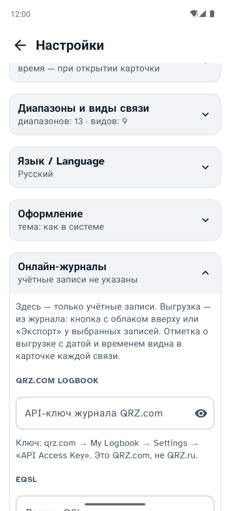
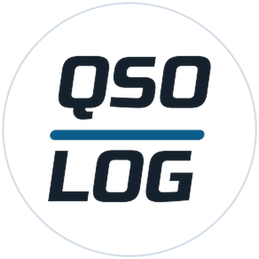

<h1>
<picture>
<source media="(prefers-color-scheme: dark)" srcset="docs/logo-dark.png">

</picture>
</h1>

**Аппаратный журнал радиолюбителя для телефона и компьютера: Android, macOS, Windows и Linux.**
Быстрый ввод связей в эфире, данные абонента с QRZ.ru, расстояние и карта трассы, голосовые заметки,
обмен журналом через ADIF, выгрузка в LoTW, QRZ.com, eQSL и Club Log, отчёты для соревнований ЕРМАК / Cabrillo. Крупный шрифт и большие кнопки —
чтобы вести лог прямо во время связи. **Интерфейс на русском и английском** — язык выбирается в настройках.

> **In English:** QSO-LOG is a free ham radio logbook for Android, macOS (Apple Silicon and Intel), Windows and Linux:
> fast QSO entry, station data from QRZ.ru and HamQTH, distance and path map, voice notes, ADIF import/export,
> upload to LoTW, QRZ.com, eQSL and Club Log,
> ERMAK / Cabrillo contest reports. The interface is available in English — Settings → “Language / Язык”.

<p align="center">

</p>

| Платформа | Версия | Скачать |
|---|---|---|
| **Android** 8.0 и новее | 0.24.1 | [QSO-LOG-0.24.1.apk](../../releases/tag/v0.24.1) |
| **macOS** 11 и новее, Apple Silicon (M1 и новее) | 1.9.1 | [QSO-LOG-1.9.1-macos-arm64.dmg](../../releases/tag/desktop-v1.9.1) |
| **macOS** 11 и новее, Intel (в том числе Ventura) | 1.9.1 | [QSO-LOG-1.9.1-macos-x64.dmg](../../releases/tag/desktop-v1.9.1) |
| **Windows** 10/11, 64 бит | 1.9.1 | [QSO-LOG-1.9.1-windows-x64.zip](../../releases/tag/desktop-v1.9.1) |
| **Linux**: Ubuntu 22.04+, Debian 12, Mint (64 бит) | 1.9.1 | [QSO-LOG-1.9.1-linux-amd64.deb](../../releases/tag/desktop-v1.9.1) |

Сайт: **[vladkondratyev.github.io/qso-log](https://vladkondratyev.github.io/qso-log/)** — скачать для своей системы в один клик.
Установка: [Android](#установка-на-android) · [macOS](#установка-на-macos) · [Windows](#установка-на-windows) ·
[Linux](#установка-на-linux-ubuntu-debian). Всё бесплатно, исходный код открыт (MIT).

## Содержание

- [Одна программа — четыре системы](#одна-программа--четыре-системы)
- [Быстрый старт](#быстрый-старт)
- [Журнал QSO: поиск и сортировка](#журнал-qso-поиск-и-сортировка)
- [Новый QSO: ввод связи в эфире](#новый-qso-ввод-связи-в-эфире)
- [QRZ.ru и другие источники данных об абоненте](#qrzru-и-другие-источники-данных-об-абоненте)
- [Голосовые заметки](#голосовые-заметки)
- [Расстояние и карты](#расстояние-и-карты)
- [Импорт, экспорт, отчёты для соревнований](#импорт-экспорт-отчёты-для-соревнований)
- [Выгрузка в LoTW, QRZ.com, eQSL, Club Log](#выгрузка-в-lotw-qrzcom-eqsl-club-log)
- [Справка и калькуляторы](#справка-и-калькуляторы)
- [Настройки и оформление](#настройки-и-оформление)
- [Язык интерфейса / Interface language](#язык-интерфейса--interface-language)
- [QSO-LOG на компьютере](#qso-log-на-компьютере)
- [Установка](#установка-на-android) · [Данные и приватность](#данные-и-приватность) · [Сборка](#сборка-из-исходников)

## Одна программа — четыре системы

QSO-LOG написан на Kotlin: общая часть (журнал, ADIF, ЕРМАК/Cabrillo, расчёт расстояния, QRZ.ru, HamQTH) одна для
всех систем, интерфейс — Jetpack Compose на Android и Compose Multiplatform на компьютере. Поэтому **версия для
компьютера умеет то же, что и Android**: версия 1.9.1 для macOS, Windows и Linux соответствует Android 0.24.1.

- **Телефон** — в эфире, в походе, на даче: одна рука, крупные кнопки, голосовая заметка удержанием кнопки.
- **Компьютер** — в шеке: окно в две колонки (журнал слева, карточка справа), ввод с клавиатуры, горячие клавиши.
- **Журнал переносится** между устройствами файлом ADIF: экспорт на одном, импорт на другом, повторы пропускаются.
- **Интерфейс на русском и английском** на всех системах — один общий словарь для телефона и компьютера.

| | Android | macOS | Windows | Linux |
|---|---|---|---|---|
| Процессоры | ARM, x86 | Apple Silicon и Intel | x64 | amd64 |
| Голосовые заметки | AAC (.m4a), ~240 КБ/мин | WAV, ~1 МБ/мин | WAV | WAV |
| «Отправить» связь | в любое приложение (мессенджер, почта) | текст в буфер обмена, заметка — WAV + .txt | так же | так же |
| Пароли QRZ.ru | зашифрованное хранилище Android | Связка ключей | Диспетчер учётных данных | GNOME Keyring / KWallet |
| Проверка обновлений | APK с GitHub | DMG для своего процессора | ZIP | DEB |

## Быстрый старт

При первом запуске программа за три шага спрашивает главное: **позывной**, **где вы находитесь** (QTH-локатор или
город — локатор найдётся сам) и **доступ к QRZ.ru**. Любой шаг можно пропустить («Настроить позже») — всё то же
есть в настройках.

<p>


</p>

Дальше — кнопка **«Добавить QSO»** внизу экрана: позывной → частота → RST → «Сохранить».

## Журнал QSO: поиск и сортировка

- Связи сгруппированы по дням, самая свежая сверху. В строке: позывной, время UTC, диапазон или частота, вид, RST,
  расстояние, имя и QTH абонента; 🎤 — есть голосовая заметка.
- **Поиск** по позывному, имени, городу, локатору и комментарию. Если набран позывной (4–6 латинских букв и цифр),
  которого в журнале нет, программа сама ищет его на QRZ.ru и, если нашла, открывает «Новый QSO» с его данными.
- Если поиск нашёл в журнале **одного абонента**, «Добавить QSO» открывает карточку для него: имя, QTH и локатор из
  последней связи, число прошлых QSO — и сразу уточнение на QRZ.ru.
- **Сортировка** кнопками над списком: по дате, расстоянию, позывному, диапазону. Повторное нажатие меняет направление.
  При запуске журнал всегда отсортирован по дате.
- **⟳ у записи** — повторный запрос данных QRZ.ru для связи, сохранённой без интернета: допишутся имя, город,
  локатор и расстояние.
- **Выбор нескольких записей** долгим нажатием (на компьютере ещё ⌘/Ctrl-щелчок) и «Экспорт» → ADIF или ЕРМАК / Cabrillo.
- Удалить связь можно только значком корзины в её карточке — с подтверждением и кнопкой «Отменить».

<p>


</p>

## Новый QSO: ввод связи в эфире

- Карточка открывается с курсором в поле позывного. Дата и время UTC ставятся сами; поправить — ✎.
  Вид связи, диапазон и частота берутся из последней связи.
- **Подсказки из журнала**: уже со второго символа под полем появляются позывные, с которыми вы работали, —
  одно нажатие вместо набора целиком.
- Данные абонента подтягиваются с QRZ.ru, пока вы набираете позывной (с 4-го символа).
- **Жёлтая плашка** — сколько раз уже работали и когда последний раз. **Красная «Повтор»** — в этот день уже была
  связь с этим позывным на том же диапазоне и виде (важно в соревнованиях).
- **Частота** в МГц или в кГц: «14195» программа поймёт как 14.195 МГц и сохранит в МГц. Частота сама выбирает диапазон.
- Вид связи и диапазон — строки кнопок (какие показывать, выбирается в настройках; если включён один — он просто подписан).
- RST — цифровая клавиатура и кнопки частых отчётов: 59/57/55, 599/579/559, для цифровых видов −05/−10/−15.
- **«＋ Следующая»** — сохранить и сразу открыть новую карточку на той же частоте и виде (пайлап, соревнование).
- «Все поля ADIF» — раскрывающиеся группы: Абонент (область, район, зоны, QSL via), Связь (мощность, QSL,
  контрольные номера, комментарий), Моя станция, Прохождение (SFI, A, K).
- **Время связи** — момент открытия карточки или момент сохранения (переключатель в настройках, блок «Ввод связи»).
- В сохранённой записи внизу: корзина, «Отправить» (связь текстом и голосовая заметка — в мессенджер, почту)
  и «Сохранить».

<p>


</p>

## QRZ.ru и другие источники данных об абоненте

Имя, город, локатор и координаты абонента программа ищет по порядку в трёх источниках. Все они собраны в
настройках в одном блоке **«Источники данных об абоненте»**, в заголовке — состояние каждого.

1. **QRZ.ru XML API — основной и правильный способ.** Официальный интерфейс QRZ.ru для программ-журналов:
   имя, город, страна, QTH-локатор, координаты. Как получить доступ (так же написано в настройках):
   1. Войдите на qrz.ru. Ваш позывной должен быть в Callbook QRZ.ru.
   2. Откройте «Личные данные» → внизу раздел «XML API» → «Создать аккаунт»
      ([прямая ссылка](https://www.qrz.ru/personal/settings/apiuser)).
   3. Укажите свой позывной и программу: QSO-LOG.
   4. Логин и пароль для XML API придут через некоторое время. Это не пароль от сайта.

   Доступ дают только на постоянные позывные радиолюбителей и наблюдателей, для личного аппаратного журнала.
   Подробнее — в [справке QRZ.ru](https://www.qrz.ru/help/api/xml).
2. **Учётная запись сайта QRZ.ru — запасной способ**, если доступа к XML API нет. Укажите e-mail и пароль, с которыми
   входите на qrz.ru: программа прочитает страницу позывного `https://www.qrz.ru/db/ПОЗЫВНОЙ` — имя и фамилию, город,
   область, страну и район RDA. Если указаны обе учётные записи, данные берутся через XML API, а сайт — только когда
   XML API не ответил. Минусы: страница сайта может поменяться, и поиск перестанет работать; каждый запрос добавляет
   абоненту «Просмотр»; правила сайта могут запрещать автоматические запросы.
3. **HamQTH.com — без учётной записи.** Если QRZ.ru ничего не дал, по префиксу позывного приходят страна, область,
   зоны CQ/ITU и центр области. Расстояние тогда примерное, со знаком «≈». Выключается в настройках.

Нет интернета — связь всё равно сохраняется, а в журнале у неё появляется ⟳ «Данные QRZ.ru не получены».

<p>


</p>

## Голосовые заметки

Записать голос абонента или свою пометку можно тремя способами:
- **Удерживайте «Добавить QSO»** — идёт запись; отпустите — откроется карточка с заметкой.
- **Нажмите на микрофон** справа на кнопке «Добавить QSO» — запись пошла; нажмите кнопку ещё раз — стоп и карточка.
- **Микрофон в заголовке «Новый QSO»** — появляется, когда QRZ.ru нашёл абонента; запись идёт до ■ или «Сохранить».

▶ рядом с позывным проигрывает заметку, **⋮** рядом — меню «Отправить заметку» (файл и параметры связи текстом:
позывной, дата и время UTC, диапазон, частота, вид, RST, имя, QTH, расстояние) и «Удалить заметку».
В свойствах файла исполнитель (Artist) — «Recorded in QSO-LOG», так запись легко узнать в плеере или на диске.

<p>


</p>

## Расстояние и карты

- Расстояние и азимут до абонента считаются от вашего QTH-локатора (он может быть свой в каждой записи —
  для экспедиций). Под ними — **карта трассы** по дуге большого круга; «Карта» открывает её на весь экран.
- **Карта QSO** (значок карты вверху) — все абоненты журнала на карте OpenStreetMap, «ПОЗЫВНОЙ ×N» для нескольких
  связей; нажатие на точку открывает последнюю связь. Ваша станция отмечена мишенью.

<p>


</p>

## Импорт, экспорт, отчёты для соревнований

- **ADIF (.adi)** — обмен с LogHX, UR5EQF, HamLog, N1MM, QRZ.com и между телефоном и компьютером. Экспорт в
  Windows-1251 (как LogHX), при импорте кодировка определяется сама. Сохраняются все поля файла, даже незнакомые программе.
- **CSV** для Excel, разделитель «;».
- **ЕРМАК** ([ermak.srr.ru](https://ermak.srr.ru/)) — отчёты российских соревнований, и **Cabrillo 3.0** (`.cbr`) —
  международный формат. Экспорт всего журнала или выбранных записей, импорт отчёта обратно. Программа спрашивает код
  соревнования, категорию и район RDA; контрольные номера — из полей карточки, иначе 001, 002…
- При любом импорте повторы (тот же позывной, минута, диапазон и вид) пропускаются.

<p>

</p>

## Выгрузка в LoTW, QRZ.com, eQSL, Club Log

Настройки → **«Онлайн-журналы»**: у каждого сервиса свои поля учётной записи и кнопка «Отправить новые (N)».
Отправляются только связи, которых в этом журнале ещё нет. Отметка об отправке хранится в самой связи —
в стандартных полях ADIF (`LOTW_QSL_SENT`, `QRZCOM_QSO_UPLOAD_STATUS`, `EQSL_QSL_SENT`, `CLUBLOG_QSO_UPLOAD_STATUS`
и даты к ним), поэтому переносится и при экспорте ADIF. Связи, которые сервис уже знал, считаются отправленными.

| Сервис | Что нужно | Как работает |
|---|---|---|
| **LoTW** (ARRL) | программа [TQSL](https://lotw.arrl.org) с вашим сертификатом, название Station Location | Компьютер: QSO-LOG сам запускает TQSL — тот подписывает связи и отправляет в LoTW. Android: TQSL для телефона нет — «Экспорт для LoTW» сохраняет файл, его подписывают в TQSL на компьютере |
| **QRZ.com Logbook** | API-ключ журнала: qrz.com → My Logbook → Settings → API Access Key | каждая новая связь отправляется в журнал QRZ.com |
| **eQSL** | логин и пароль eQSL, при нескольких местах — QTH Nickname | новые связи уходят одним файлом ADIF |
| **Club Log** | e-mail, пароль и ключ приложения (API key) — Club Log выдаёт его по запросу через Help Desk | новые связи уходят одним файлом ADIF; позывной — из «Моей станции» |

Ключи и пароли хранятся так же, как пароль QRZ.ru: в зашифрованном хранилище Android или в системной связке ключей.

<p>

</p>

## Справка и калькуляторы

Кнопка с книгой в шапке журнала (на компьютере — там же и в меню «Файл») открывает справку из десяти вкладок:

| Вкладка | Что там |
|---|---|
| **Частоты РФ** | полосы любительской службы по решению ГКРЧ от 15.07.2010 № 10-07-01 — от 2200 м до 250 ГГц; мощность и участки по категориям — на [srr.ru](https://srr.ru/radiooperatoram/radiochastoty/) |
| **План и активность** | упрощённый план IARU Region 1 (CW, цифра, SSB, маяки); частоты FT8, FT4, JS8, WSPR, PSK31, SSTV, QRP, аварийные центры, вызывные УКВ, APRS, МКС; **маяки NCDXF/IARU — какой маяк сейчас в эфире на каждой частоте** |
| **Морзе** | латиница, кириллица, цифры, знаки и служебные сигналы; точки и тире в пропорции 1 : 3 |
| **Позывные** | алфавит ICAO и русская таблица чтения позывных |
| **Коды** | Q-коды, CW-сокращения, шкалы RST (R, S, T) |
| **Уровни** | калькуляторы Вт ↔ dBm ↔ dBW и ЭИИМ/ЭИМ (усиление в dBi или dBd, потери в кабеле); таблица мощностей; S-метр по IARU (КВ и УКВ, dBm и мкВ) |
| **Кабели** | калькулятор потерь: кабель, частота, длина, мощность → потери в дБ и сколько ватт дойдёт до антенны (или «Свой кабель» по паспорту); таблица затухания RG-174, RG-58, H155, LMR-240, Aircell 7, RG-213, Ecoflex 10, LMR-400, Ecoflex 15 и коэффициенты укорочения; КСВ ↔ отражённая мощность, обратные потери и потери рассогласования |
| **Антенны** | длины на выбранной частоте: λ, диполь и плечо, GP и противовесы, рамка; четвертьволновый отрезок кабеля |
| **Префиксы** | страна DXCC, континент, зоны CQ/ITU и расстояние по позывному без интернета (файл cty.dat), для России — субъект и код RDA; таблица регионов в позывных (R3X… — Калужская) |
| **Прохождение** | что значат SFI, A- и K-индексы; часовые пояса России с текущим временем и UTC |

Источники: решение ГКРЧ № 10-07-01; таблица кабелей [DD1US](https://www.dd1us.de) (апрель 2024, по паспортам производителей);
country file cty.dat — Jim Reisert AD1C, [country-files.com](https://www.country-files.com); список субъектов РФ и их обозначений —
[СРР](https://srr.ru/spisok-subektov-rossijskoj-federats/). Значения справочные: проверяйте актуальные документы и паспорт своего кабеля.

<p>


</p>
<p>


</p>

## Настройки и оформление

- Разделы сворачиваются, в заголовке каждого — итог: позывной и локатор, состояние источников данных, время связи,
  число диапазонов, тема, число записей.
- **Моя станция**: позывной, QTH-локатор («Определить локатор» — по карточке QRZ.ru или по городу), город, а для новых
  записей — мощность, трансивер, антенна, оператор, область, район.
- **Диапазоны и виды связи**: какие показывать кнопками в карточке; хотя бы один диапазон и один вид всегда включены.
- **Язык / Language**: как в системе, русский или English (см. ниже).
- **Оформление**: тема как в системе, светлая или тёмная. Экраны проверены с увеличенным системным шрифтом.
- **Проверить обновления**: программа узнаёт на GitHub, есть ли версия новее, показывает, что изменилось, и даёт скачать.

<p>


</p>

<details>
<summary>Ещё скриншоты Android</summary>
<p>


</p>
</details>

На скриншотах демонстрационные данные: позывные `*DEMO` выдуманы.

## Язык интерфейса / Interface language

Настройки → **«Язык / Language»**: «Как в системе», «Русский» или «English». Язык меняется сразу, без перезапуска,
на телефоне и на компьютере одинаково. «Как в системе» — русский, если язык системы русский, украинский или
белорусский, иначе английский. После обновления уже настроенной программы язык остаётся русским.

Settings → **“Language / Язык”**: “As in system”, “Русский” or “English”. The language changes at once, no restart,
the same on the phone and on the computer.

<p>


</p>
<p>

</p>

## QSO-LOG на компьютере

Окно в две колонки: слева журнал с поиском и сортировкой, справа — карточка связи, карта или настройки.
Всё, что описано выше, работает так же; отличия — только там, где у компьютера свои привычки.

<p>


</p>

**Клавиатура** — ввод связи можно вести, не трогая мышь:

| Клавиши (macOS / Windows, Linux) | Действие |
|---|---|
| ⌘N / Ctrl+N | новый QSO |
| Enter | следующее поле; в «RST принят» — сохранить |
| ⌘S / Ctrl+S | сохранить |
| ⇧⌘S / Ctrl+Shift+S | сохранить и открыть следующую («＋ Следующая») |
| Alt+1…9 | диапазон: первый, второй… из включённых в настройках |
| Alt+Shift+1…9 | вид связи: первый, второй… из включённых |
| Esc | закрыть карточку (с изменениями — спросит) или отменить выбор |
| ⌘M / Ctrl+M | карта QSO |
| ⌘, / Ctrl+, | настройки |

- Голосовая заметка: удерживайте «Добавить QSO» мышью или нажмите на микрофон на кнопке. Запись в WAV.
- «Отправить» и «Отправить заметку»: WAV сохраняется в выбранную папку, рядом — .txt с параметрами связи,
  текст копируется в буфер обмена (без заметки — только текст в буфер).
- Меню «Файл»: импорт и экспорт ADIF, CSV, ЕРМАК / Cabrillo.

<details>
<summary>Ещё скриншоты версии для компьютера</summary>
<p>


</p>
</details>

## Установка на Android

1. Скачайте `QSO-LOG-0.24.1.apk` со страницы [релиза](../../releases/tag/v0.24.1).
2. Откройте файл на телефоне. Если Android спросит, разрешите установку из этого источника.
3. Новую версию ставьте поверх старой: лог и настройки сохранятся.

## Установка на macOS

1. Скачайте со страницы [релиза](../../releases/tag/desktop-v1.9.1) файл для своего Mac (macOS 11 и новее):
   `QSO-LOG-1.9.1-macos-arm64.dmg` — процессор Apple (M1 и новее), `QSO-LOG-1.9.1-macos-x64.dmg` — процессор Intel.
   Какой у вас: меню  → «Об этом Mac», строка «Чип» (Apple) или «Процессор» (Intel).
2. Откройте DMG и перетащите QSO-LOG в «Программы».
3. Программа не подписана сертификатом Apple, поэтому первый запуск macOS заблокирует. Откройте
   «Системные настройки» → «Конфиденциальность и безопасность», внизу у сообщения про QSO-LOG нажмите
   «Всё равно открыть».
4. При первой голосовой заметке macOS спросит доступ к микрофону — разрешите.

Лог и настройки: `~/Library/Application Support/QSO Log`, пароли QRZ.ru — в Связке ключей.
Новую версию ставьте поверх старой, данные останутся.

## Установка на Windows

1. Скачайте `QSO-LOG-1.9.1-windows-x64.zip` со страницы [релиза](../../releases/tag/desktop-v1.9.1).
2. Распакуйте архив целиком, например в «Документы». Из самого архива программа не запустится.
3. Запустите `QSO-LOG.exe` в папке QSO-LOG. Java устанавливать не нужно, она внутри.
4. Windows покажет «Система Windows защитила ваш компьютер», потому что программа не подписана:
   нажмите «Подробнее» → «Выполнить в любом случае».
5. Если голосовая заметка не пишется: «Параметры» → «Конфиденциальность и защита» → «Микрофон» →
   включите «Разрешить классическим приложениям доступ к микрофону».

Лог и настройки: `%APPDATA%\QSO Log`, пароли QRZ.ru — в Диспетчере учётных данных.
Для обновления замените папку программы, данные останутся. Подробнее — в `README.txt` внутри архива.

## Установка на Linux (Ubuntu, Debian)

1. Скачайте `QSO-LOG-1.9.1-linux-amd64.deb` со страницы [релиза](../../releases/tag/desktop-v1.9.1).
2. Установите в терминале из папки с файлом:
   ```bash
   sudo apt install ./QSO-LOG-1.9.1-linux-amd64.deb
   ```
   Или двойным щелчком по файлу в «Центре приложений».
3. QSO-LOG появится в меню приложений (раздел «Любительское радио» / «Интернет»).
   Запуск из терминала: `/opt/qso-log/bin/QSO-LOG`.

Программа ставится в `/opt/qso-log`, Java уже внутри. Лог и настройки: `~/.local/share/qso-log`.
Пароли QRZ.ru — в связке ключей (GNOME Keyring, KWallet), а если её нет — в файле настроек.
Удалить программу: `sudo apt remove qso-log` (лог в домашней папке останется).

## Данные и приватность

- Лог, настройки и голосовые заметки хранятся только на вашем телефоне или компьютере.
- Пароли QRZ.ru (XML API и сайта) — в зашифрованном хранилище Android или в системной связке ключей компьютера.
- Программа обращается в сеть только к `api.qrz.ru` (поиск позывных), к `logbook.qrz.com`, `eqsl.cc` и `clublog.org`
  (только когда вы нажимаете «Отправить новые»), к `www.qrz.ru` (если указана учётная запись
  сайта), к `hamqth.com` (если второй источник включён), к серверам тайлов OpenStreetMap (карты) и к GitHub —
  только когда вы нажимаете «Проверить обновления».

## Сборка из исходников

Нужны JDK 17 (Temurin) и Android SDK (platform 34).

```bash
./gradlew :app:assembleDebug           # APK: app/build/outputs/apk/debug/app-debug.apk
./gradlew :shared:test :desktop:test   # тесты: ADIF, ЕРМАК/Cabrillo, QRZ.ru, частоты, база, голосовые заметки
./gradlew :desktop:run                 # версия для компьютера, запуск для разработки
./gradlew :desktop:screenshots         # скриншоты версии для компьютера с демо-данными → docs/screenshots
./gradlew :desktop:packageReleaseDmg   # DMG для macOS на своём процессоре
# DMG для Intel-Mac: тот же Gradle на Temurin 17 для x64 под Rosetta
JAVA_HOME=/путь/к/temurin-17-x64/Contents/Home arch -x86_64 ./gradlew --no-daemon :desktop:packageReleaseDmg
./desktop/windows/build-windows.sh     # ZIP для Windows, собирается на Mac (см. комментарий в скрипте)
./desktop/linux/build-linux.sh         # DEB для Ubuntu/Debian, собирается на Mac через Docker
python3 desktop/icons/make_icon.py     # значки для компьютера (icns, ico, png)
```

Структура:
- `shared/` — общее для всех систем: модель QSO, расстояние и азимут, ADIF, CSV, ЕРМАК/Cabrillo, клиенты QRZ.ru
  (XML API и страница сайта) и HamQTH (чистый Kotlin/JVM);
- `app/` — Android (Jetpack Compose, Material 3, SQLite, osmdroid);
- `desktop/` — macOS, Windows и Linux (Compose Multiplatform, SQLite, своя карта на тайлах OpenStreetMap,
  запись голоса через Java Sound).

## Известные ограничения

- Сборка Android — отладочная (debug), для установки вручную, не для Google Play.
- Сборки для macOS и Windows не подписаны сертификатами Apple и Microsoft, система предупредит при первом запуске.
- Версия для Windows собрана на Mac и на самой Windows не проверялась; пакет для Linux проверен в Ubuntu 24.04
  без микрофона. Если что-то не работает, откройте issue.
- «Как в системе» в Linux — светлая тема; тёмную можно выбрать в настройках вручную.
- При мелком масштабе подписи соседних станций на карте QSO могут накладываться.
- Голосовые заметки не попадают в файлы экспорта и между устройствами не переносятся.

## Логотип

QSO-LOG набран шрифтом Russo One с наклоном 8°, дефис — цвет акцента приложения (#0A5C8A, в тёмной теме #6BBEEF).
Файлы: `docs/logo-light.png`, `docs/logo-dark.png`.



Значок приложения: QSO и LOG тем же шрифтом с наклоном, между ними синяя черта. Надпись собрана в квадрат
и вписана в круг, поэтому не обрезается ни одной формой значка Android. Для тем Android 13 есть монохромный вариант.
Тот же значок у версий для macOS, Windows и Linux.
<br clear="left">

## Лицензия

[MIT](LICENSE). Шрифты и библиотеки: [THIRD_PARTY_NOTICES.md](THIRD_PARTY_NOTICES.md).
