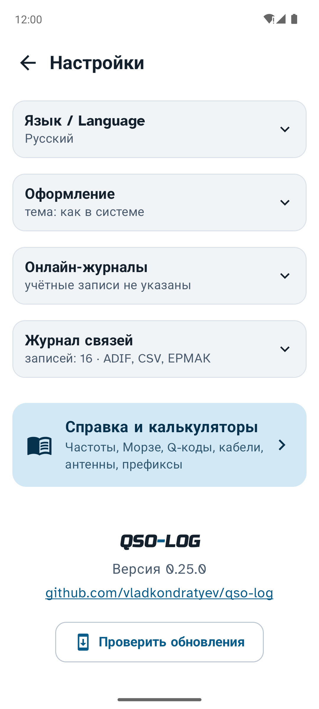

<h1>
<picture>
<source media="(prefers-color-scheme: dark)" srcset="docs/logo-dark.png">

</picture>
</h1>

QSO-LOG — аппаратный журнал радиолюбителя. Работает на Android, macOS, Windows и Linux, на телефоне и на компьютере
умеет одно и то же.

Связь записывается за несколько нажатий: позывной, частота, RST. Имя и город абонента программа сама берёт с QRZ.ru,
считает расстояние и показывает трассу на карте. К связи можно приложить голосовую заметку. Журнал выгружается
в ADIF и CSV, для соревнований есть отчёты ЕРМАК и Cabrillo. Кнопки и шрифт крупные, чтобы вести лог прямо в эфире.

Программа бесплатная, исходный код открыт. Интерфейс на русском и английском.

<p align="center">

</p>

## Скачать

| Система | Версия | Файл |
|---|---|---|
| Android 8.0 и новее | 0.26.1 | [QSO-LOG-0.26.1.apk](../../releases/tag/v0.26.1) |
| macOS 11 и новее, процессор Apple (M1 и новее) | 1.11.1 | [QSO-LOG-1.11.1-macos-arm64.dmg](../../releases/tag/desktop-v1.11.1) |
| macOS 11 и новее, процессор Intel | 1.11.1 | [QSO-LOG-1.11.1-macos-x64.dmg](../../releases/tag/desktop-v1.11.1) |
| Windows 10 и 11, 64 бит | 1.11.1 | [QSO-LOG-1.11.1-windows-x64.zip](../../releases/tag/desktop-v1.11.1) |
| Linux: Ubuntu 22.04+, Debian 12, Mint | 1.11.1 | [QSO-LOG-1.11.1-linux-amd64.deb](../../releases/tag/desktop-v1.11.1) |

Как установить: [Android](#android) · [macOS](#macos) · [Windows](#windows) · [Linux](#linux).
Есть и [страница программы](https://vladkondratyev.github.io/qso-log/), она сама предложит файл для вашей системы.

## Содержание

- [Первый запуск](#первый-запуск)
- [Новая связь](#новая-связь)
- [Журнал](#журнал)
- [Данные об абоненте](#данные-об-абоненте)
- [Голосовые заметки](#голосовые-заметки)
- [Расстояние и карты](#расстояние-и-карты)
- [Экспорт и импорт](#экспорт-и-импорт)
- [Справочник и калькуляторы](#справочник-и-калькуляторы)
- [Настройки](#настройки)
- [На компьютере](#на-компьютере)
- [Установка](#установка)
- [Где хранятся данные](#где-хранятся-данные)
- [Что пока не так](#что-пока-не-так)
- [Для разработчиков](#для-разработчиков)

## Первый запуск

Программа спросит три вещи: ваш позывной, где вы находитесь и доступ к QRZ.ru. Вместо QTH-локатора можно написать
город, локатор найдётся сам. Любой шаг можно пропустить и заполнить потом в настройках.

После этого внизу экрана появится кнопка «Добавить QSO». С неё начинается каждая связь.

<p>


</p>

## Новая связь

Карточка открывается сразу с курсором в поле позывного. Дата и время UTC ставятся сами. Вид связи, диапазон
и частота берутся из прошлой связи, так что обычно остаётся ввести позывной и RST.

Что помогает при вводе:

- Со второй буквы под полем появляются позывные из вашего журнала. Можно выбрать, а не набирать целиком.
- С четвёртой буквы программа ищет абонента на QRZ.ru и заполняет имя, город и локатор.
- Жёлтая плашка показывает, сколько раз вы уже работали с этим позывным и когда последний раз.
- Красная плашка «Повтор» появляется, если сегодня уже была связь с ним на том же диапазоне и виде.
  Пригодится в соревнованиях.
- Частоту можно вводить в килогерцах: 14195 превратится в 14.195 МГц. Диапазон по частоте выберется сам.
- Для RST открывается цифровая клавиатура, а под полем есть кнопки частых отчётов: 59, 57, 599, −10 и так далее.
- «＋ Следующая» сохраняет связь и сразу открывает новую карточку на той же частоте. Удобно в пайлапе.

Остальные поля ADIF спрятаны в раскрывающиеся группы: абонент, связь, моя станция, прохождение. Время связи
можно брать в момент открытия карточки или в момент сохранения, это выбирается в настройках.

В сохранённой связи внизу три кнопки: удалить, отправить (текстом и с голосовой заметкой, в мессенджер или почту)
и сохранить.

<p>


</p>

## Журнал

Связи сгруппированы по дням, свежие сверху. В строке видно позывной, время, частоту, вид, RST, расстояние,
имя и город. Значок микрофона значит, что у связи есть голосовая заметка.

- **Поиск** работает по позывному, имени, городу, локатору и комментарию. Если такого позывного в журнале нет,
  программа поищет его на QRZ.ru и сразу откроет новую карточку с найденными данными.
- Если поиск нашёл одного знакомого абонента, «Добавить QSO» откроет карточку уже с его именем и городом.
- **Сортировка**: по дате, расстоянию, позывному или диапазону. Второе нажатие на ту же кнопку меняет порядок.
- Связь, сохранённая без интернета, помечена кнопкой ⟳. Нажмите её, когда сеть появится, и данные с QRZ.ru допишутся.
- Несколько связей выбираются долгим нажатием (на компьютере ещё Ctrl-щелчком или ⌘-щелчком).
  Выбранные можно выгрузить в файл кнопкой «Экспорт».
- Удалить связь можно только из её карточки. Программа переспросит, а после удаления ещё можно нажать «Отменить».

<p>


</p>

## Данные об абоненте

Имя, город и координаты абонента программа ищет в трёх местах, по очереди. Все три настраиваются в одном блоке
«Источники данных об абоненте».

**1. XML API QRZ.ru.** Основной способ, так QRZ.ru предлагает подключать программы-журналы. Логин и пароль
для API выдаёт сам QRZ.ru:

1. Войдите на qrz.ru. Ваш позывной должен быть в Callbook.
2. Откройте «Личные данные», внизу раздел «XML API», кнопка «Создать аккаунт»
   ([прямая ссылка](https://www.qrz.ru/personal/settings/apiuser)).
3. Укажите позывной и название программы: QSO-LOG.
4. Логин и пароль придут через какое-то время. Это не пароль от сайта.

Доступ дают на постоянные позывные радиолюбителей и наблюдателей. Подробности в
[справке QRZ.ru](https://www.qrz.ru/help/api/xml).

**2. Учётная запись сайта QRZ.ru.** Запасной вариант, если доступа к API нет. Вы указываете e-mail и пароль
от qrz.ru, программа открывает страницу позывного и берёт оттуда имя, город, область и район RDA. Если указаны
и API, и сайт, сначала спрашивается API. Имейте в виду: если сайт поменяет вёрстку, этот способ сломается,
а каждый запрос засчитывается абоненту как просмотр его страницы.

**3. HamQTH.** Работает без регистрации, но знает только страну, область и зоны CQ/ITU. Расстояние в этом случае
считается до центра области и помечается знаком «≈». Если не нужен, выключите в настройках.

Без интернета связь всё равно сохранится, данные можно будет подтянуть потом кнопкой ⟳.

<p>


</p>

## Голосовые заметки

Иногда проще наговорить, чем набрать. Запись можно начать тремя способами:

- удерживать «Добавить QSO»: пока держите, идёт запись, отпустили — открылась карточка с заметкой;
- нажать на микрофон справа на той же кнопке, а потом нажать ещё раз, чтобы остановить;
- нажать на микрофон в заголовке новой карточки (он появляется, когда абонент найден на QRZ.ru).
  Запись идёт до кнопки «Стоп» или до сохранения связи.

Заметка проигрывается кнопкой ▶ рядом с позывным. В меню ⋮ её можно отправить вместе с данными связи или удалить.

<p>


</p>

## Расстояние и карты

Расстояние и азимут считаются от вашего QTH-локатора. В карточке связи под ними нарисована трасса по дуге большого
круга, кнопка «Карта» открывает её на весь экран. Если вы работаете из экспедиции, локатор можно поменять
в самой связи.

Кнопка с картой вверху журнала показывает всех ваших абонентов на OpenStreetMap. Нажатие на точку открывает
последнюю связь с этой станцией.

<p>


</p>

## Экспорт и импорт

Поддерживаются три формата:

- **ADIF** (.adi) понимают LogHX, UR5EQF, HamLog, N1MM, QRZ.com и другие журналы. Через ADIF же удобно переносить
  лог между телефоном и компьютером. Кодировку файла выбираете при экспорте: UTF-8 подходит для большинства программ
  и сайтов, Windows-1251 нужна для LogHX и UR5EQF. Программа запоминает ваш выбор. При импорте кодировка
  определяется сама, и все поля файла сохраняются, даже незнакомые.
- **CSV** открывается в Excel, разделитель — точка с запятой.
- **ЕРМАК** ([ermak.srr.ru](https://ermak.srr.ru/)) для российских соревнований и **Cabrillo 3.0** для
  международных. Перед сохранением программа спросит код соревнования, категорию и район RDA.
  Контрольные номера берутся из карточки, а если их нет, ставятся по порядку: 001, 002…

Весь журнал выгружается из настроек, блок «Журнал связей». Только нужные связи — через выбор в журнале
и кнопку «Экспорт».

Перед сохранением программа задаёт два вопроса:

1. Брать только новые связи или все. «Новые» — это те, которые в этот формат ещё не выгружались. По умолчанию
   выбраны они, так что в следующий раз не придётся искать, что уже отправлено.
2. Ставить ли в карточках отметку об экспорте.

Отметки видны в самом низу карточки связи, с датой и временем, отдельно для каждого формата. Если связь надо
выгрузить ещё раз, отметку можно снять. В журнале у выгруженных связей рядом со временем стоят цветные точки:
синяя — ADIF, зелёная — CSV, оранжевая — ЕРМАК или Cabrillo.

При импорте повторы (тот же позывной, минута, диапазон и вид) пропускаются.

<p>


</p>

## Справочник и калькуляторы

Справочник открывается из настроек: голубая карточка «Справка и калькуляторы» в самом низу. На компьютере
его можно открыть ещё из меню «Файл». Всё работает без интернета.

| Вкладка | Что там |
|---|---|
| Частоты РФ | любительские полосы по решению ГКРЧ № 10-07-01, от 2200 м до 250 ГГц |
| План и активность | упрощённый план IARU Region 1, частоты FT8, FT4, WSPR, SSTV, QRP, APRS, МКС; какой маяк NCDXF сейчас в эфире |
| Морзе | латиница, кириллица, цифры и знаки |
| Позывные | фонетический алфавит ICAO и русская таблица |
| Коды | Q-коды, сокращения CW, шкала RST |
| Уровни | пересчёт Вт, dBm и dBW, расчёт ЭИИМ, шкала S-метра |
| Кабели | потери в кабеле на нужной частоте и длине, таблица затухания популярных кабелей, КСВ |
| Антенны | длина волны, диполь, GP, рамка, четвертьволновый отрезок кабеля |
| Префиксы | страна, зоны и расстояние по позывному; для России — область и код RDA |
| Прохождение | что значат SFI, A и K; часовые пояса России |

Откуда данные: решение ГКРЧ № 10-07-01, таблица кабелей [DD1US](https://www.dd1us.de), файл стран cty.dat
от AD1C ([country-files.com](https://www.country-files.com)), список субъектов РФ с сайта
[СРР](https://srr.ru/spisok-subektov-rossijskoj-federats/). Это справочные значения. Для важных решений сверяйтесь
с документами и паспортом своего кабеля.

<p>



</p>
<p>


</p>

## Настройки

Настройки разбиты на блоки. У каждого в заголовке коротко написано, что сейчас выбрано, так что раскрывать всё
подряд не нужно.

- **Моя станция**: позывной, QTH-локатор, город. Кнопка «Определить локатор» найдёт его по QRZ.ru или по городу.
  Здесь же мощность, трансивер, антенна и оператор, которые подставятся в новые связи.
- **Источники данных об абоненте**: QRZ.ru и HamQTH, см. [выше](#данные-об-абоненте).
- **Диапазоны и виды связи**: какие кнопки показывать в карточке. Если оставить один диапазон или один вид,
  кнопок не будет, он просто подпишется.
- **Язык**: как в системе, русский или английский. Меняется сразу, перезапуск не нужен.
- **Оформление**: светлая, тёмная или как в системе.
- **Журнал связей**: экспорт и импорт, удаление всего журнала.

В самом низу — справочник, номер версии и кнопка «Проверить обновления». Если на GitHub есть версия новее,
программа покажет, что в ней изменилось, и предложит скачать.

<p>


</p>

<p>


</p>

<details>
<summary>Ещё скриншоты с телефона</summary>
<p>


</p>
</details>

Все позывные на скриншотах вида `*DEMO` выдуманы.

## На компьютере

Версия для компьютера умеет всё то же, что и Android. Окно разделено на две части: слева журнал, справа карточка
связи, карта или настройки.

<p>


</p>

Связь можно ввести, не трогая мышь:

| macOS | Windows, Linux | Что делает |
|---|---|---|
| ⌘N | Ctrl+N | новая связь |
| Enter | Enter | следующее поле, в «RST принят» — сохранить |
| ⌘S | Ctrl+S | сохранить |
| ⇧⌘S | Ctrl+Shift+S | сохранить и открыть следующую |
| Alt+1…9 | Alt+1…9 | выбрать диапазон |
| Alt+Shift+1…9 | Alt+Shift+1…9 | выбрать вид связи |
| Esc | Esc | закрыть карточку или отменить выбор |
| ⌘M | Ctrl+M | карта QSO |
| ⌘, | Ctrl+, | настройки |

Несколько отличий от телефона:

- Голосовые заметки пишутся в WAV (на телефоне в M4A, файлы там в несколько раз меньше).
- «Отправить» копирует данные связи в буфер обмена. Если есть заметка, она сохраняется в выбранную папку
  вместе с текстовым файлом.
- Экспорт, импорт и справочник есть ещё в меню «Файл».

<details>
<summary>Ещё скриншоты с компьютера</summary>
<p>


</p>
</details>

## Установка

Новую версию на любой системе ставьте поверх старой. Журнал и настройки сохранятся.

### Android

1. Скачайте `QSO-LOG-0.26.1.apk` со [страницы релиза](../../releases/tag/v0.26.1).
2. Откройте файл на телефоне. Android может попросить разрешить установку из этого источника — разрешите.

### macOS

1. Скачайте со [страницы релиза](../../releases/tag/desktop-v1.11.1) файл для своего Mac:
   - `QSO-LOG-1.11.1-macos-arm64.dmg`, если процессор Apple (M1 и новее);
   - `QSO-LOG-1.11.1-macos-x64.dmg`, если Intel.

   Узнать, какой у вас, можно в меню  → «Об этом Mac».
2. Откройте DMG и перетащите QSO-LOG в «Программы».
3. При первом запуске macOS скажет, что не может проверить разработчика: программа не подписана сертификатом Apple.
   Откройте «Системные настройки» → «Конфиденциальность и безопасность» и внизу нажмите «Всё равно открыть».
4. Когда вы первый раз запишете голосовую заметку, macOS спросит доступ к микрофону.

### Windows

1. Скачайте `QSO-LOG-1.11.1-windows-x64.zip` со [страницы релиза](../../releases/tag/desktop-v1.11.1).
2. Распакуйте архив целиком, например в «Документы». Прямо из архива программа не запустится.
3. Запустите `QSO-LOG.exe`. Java ставить не нужно, она уже в папке.
4. Windows может показать «Система Windows защитила ваш компьютер», потому что программа не подписана.
   Нажмите «Подробнее» и «Выполнить в любом случае».
5. Если заметки не записываются, разрешите доступ к микрофону: «Параметры» → «Конфиденциальность и защита» →
   «Микрофон» → «Разрешить классическим приложениям доступ к микрофону».

Чтобы обновить программу, замените папку. Подробнее — в `README.txt` внутри архива.

### Linux

1. Скачайте `QSO-LOG-1.11.1-linux-amd64.deb` со [страницы релиза](../../releases/tag/desktop-v1.11.1).
2. Установите двойным щелчком или из терминала:
   ```bash
   sudo apt install ./QSO-LOG-1.11.1-linux-amd64.deb
   ```
3. QSO-LOG появится в меню приложений, в разделе «Любительское радио».

Удалить: `sudo apt remove qso-log`. Журнал в домашней папке при этом останется.

## Где хранятся данные

Журнал, настройки и заметки лежат только на вашем устройстве:

| Система | Папка с журналом | Пароли QRZ.ru |
|---|---|---|
| Android | внутри приложения | зашифрованное хранилище Android |
| macOS | `~/Library/Application Support/QSO Log` | Связка ключей |
| Windows | `%APPDATA%\QSO Log` | Диспетчер учётных данных |
| Linux | `~/.local/share/qso-log` | GNOME Keyring или KWallet, если их нет — файл настроек |

В интернет программа ходит только за данными абонентов (api.qrz.ru, www.qrz.ru, hamqth.com), за картами
OpenStreetMap и на GitHub, когда вы проверяете обновления.

## Что пока не так

- Android-версия собрана для ручной установки, в Google Play её нет.
- Версии для macOS и Windows не подписаны, поэтому система предупреждает при первом запуске.
- Версию для Windows я собираю на Mac, на настоящей Windows её пока никто не проверял. Linux-версия проверена
  в Ubuntu 24.04, но без микрофона. Если что-то не работает, напишите в [issues](../../issues).
- В Linux вариант «как в системе» всегда даёт светлую тему. Тёмную можно включить вручную.
- На карте QSO подписи соседних станций при мелком масштабе накладываются.
- Голосовые заметки не попадают в файлы экспорта и между устройствами не переносятся.

## Для разработчиков

Программа написана на Kotlin. Общая часть (журнал, форматы, расчёты, QRZ.ru, HamQTH, справочник) одна
для всех систем. Интерфейс на Android сделан на Jetpack Compose, на компьютере — на Compose Multiplatform.

- `shared/` — общий код;
- `app/` — Android;
- `desktop/` — macOS, Windows и Linux.

Нужны JDK 17 (Temurin) и Android SDK 34.

```bash
./gradlew :app:assembleDebug           # APK для Android
./gradlew :shared:test :desktop:test   # тесты
./gradlew :desktop:run                 # запустить версию для компьютера
./gradlew :desktop:screenshots         # скриншоты для этого README
./gradlew :desktop:packageReleaseDmg   # DMG для своего Mac
# DMG для Intel: тот же Gradle с Temurin 17 x64 под Rosetta
JAVA_HOME=/путь/к/temurin-17-x64/Contents/Home arch -x86_64 ./gradlew --no-daemon :desktop:packageReleaseDmg
./desktop/windows/build-windows.sh     # ZIP для Windows (собирается на Mac)
./desktop/linux/build-linux.sh         # DEB для Linux (собирается на Mac в Docker)
```

## Лицензия

[MIT](LICENSE). Лицензии шрифтов, библиотек и справочных данных — в [THIRD_PARTY_NOTICES.md](THIRD_PARTY_NOTICES.md).
